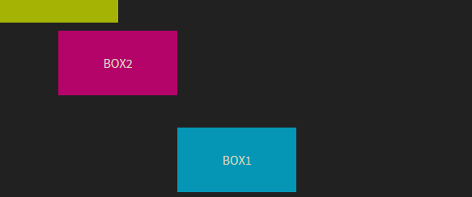
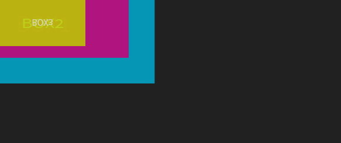
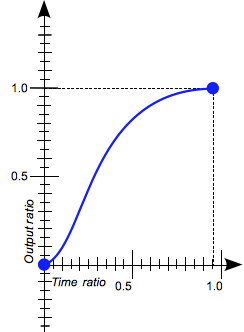

CSS transformaties, transities en animaties
===========================================

|Info|  |
|----|---|
|Olod|New Media Design & Development I|
|Auteur(s)|Philippe De Pauw - Waterschoot, Jonas Pottie|
|Opleiding|Bachelor in de Grafische en digitale media|
|Academiejaar|2015-16|

***

Transformaties
--------------

Transformaties laten toe om de positie, grootte en vorm van een element te veranderen. In CSS kunnen we een element: verplaatsen (move), schalen (scale), roteren (rotate) en uitrekken/scheeftrekken (skew). Zowel 2D als 3D transformaties kunnen toegepast worden in CSS. Opgelet: het transformatiepunt ligt standaard in het midden van het element!

Transformaties kunnen toegekend worden aan een element via de transform eigenschap. Voor de meeste CSS3 eigenschappen, moeten browser specifiek prefixen toegevoegd worden aan deze eigenschappen:

|Browser(s)|Prefix|
|----------|------|
|Safari en Chrome|`-webkit-`|
|Mozilla|`-moz-`|
|IE|`-ms-`|
|Opera|`-o-`|
|De standaard W3C|Geen prefix!|

###2D-translatie

Translatie of verschuiving van een element, in dit geval in de 2D-ruimte. Translatie wordt in CSS gerealiseerd via de `translate` methoden:

- `translate(tx[,ty])`
Indien ty niet gespecifieerd wordt, zal ty = 0
- `translateX(tx)`
Translatie langs de X-as
- `translateY(ty)`
Translatie langs de Y-as

De waarden van translatie (tx, ty) kunnen uitgedrukt worden in een lengte (getal gevolgd door een lengte-eenheid, zoals: px, em, in, pt, mm, …) of in percentage (%).

```html
<div class="box orig">
  BOX
</div>
<div class="box eff1">
  BOX
</div>
```

```css
.box{
  display:block;
  background:#f60;
  width:160px;
  height:90px;
  text-align:center;
  line-height:90px;
  font-size:20px;
}
.orig{
  position:fixed;
  opacity:0.2;
}
.eff1{
  -webkit-transform:translate(20px,50%);
  -moz-transform:translate(20px,50%);
  -ms-transform:translate(20px,50%);
  -o-transform:translate(20px,50%);
  transform:translate(20px,50%);
}
```

In dit voorbeeld verplaatsen we een element: 20px verschuiving langs de X-as, 50% van de hoogte van het element verschuiving langs de Y-as.

> **Output in de browser:**
>
>  

###2D-schalen

Elementen kunnen geschaald worden in de X- en/of Y-richting. Schalen wordt in CSS gerealiseerd via de `scale` methoden:

- `scale(sx[,sy])`
Indien sy niet gespecifieerd wordt, zal sy = 1
- `scaleX(sx)`
- `scaleY(sy)`

De waarden van schalen (sx, sy) moeten uitgedrukt worden met een getal (positief of negatief floating-point getal).

###Rotatie

Elementen kunnen geroteerd worden in de X- en/of Y-richting. Rotatie wordt in CSS gerealiseerd via de `rotate` methoden:

- `rotate(rz)`
- `rotateX(rx)`
- `rotateY(ry)`

De waarden van schalen (rx, ry, rz) moeten uitgedrukt worden met een getal (positief of negatief floating-point getal gevolgd door de suffix deg).

###2D-scheeftrekken

Elementen kunnen scheefgetrokken worden in de X- en/of Y-richting. Scheeftrekken wordt in CSS gerealiseerd via de `skew` methoden:

- `skew(ax[ay])`
Indien ay niet gespecifieerd wordt, zal ay = 0deg
- `skewX(ax)`
Scheeftrekken langs de X-as
- `skewY(ay)`
Scheeftrekken langs de Y-as

De waarden van scheeftrekken (ax, ay) wordt uitgedrukt in aantal graden: positief of negatief getal gevolgd door `deg`.

```css
…
.eff1{
 -webkit-transform:translate(100%, 100%) skew(45deg, -30deg);
  -moz-transform:translate(100%, 100%) skew(45deg, -30deg);
  -ms-transform:translate(100%, 100%) skew(45deg, -30deg);
  -o-transform:translate(100%, 100%) skew(45deg, -30deg);
  transform:translate(100%, 100%)  skew(45deg, -30deg);
}
```

In het voorbeeld voeren we eerst een translatie uit van 100% in beide richtingen (x en y). Gevolgd door het scheeftrekken langs de X-as met 45 graden en -30 graden langs de Y-as.

> **Output in de browser:**
>
>  

###2D-matrix

Transformaties kunnen ook voorzien worden via een 2D-matrix. Een matrix in CSS bevat 6 argumenten:

- `matrix(a, c, b, d, e, f)`

>
>
> 
>
> - a en d zorgen voor het schalen van een element
- c en b zorgen voor het roteren of schuintrekken van een element
- e en f zorgen voor de translatie in de X- en Y-richting
- Default matrix: a = 1, c = 0, b = 0, d = 1, e = 0 en f = 0
>
> 

Enkele voorbeelden:

- `transform:matrix(1,0,0,1,20,30);`
Translatie 20px in de X-richting en 30px in de Y-richting
- `transform:matrix(1,0.5,0.6,1,0,0);`
Schuintrekken van het element
- `transform:matrix(0,866,0.5,-0.5,0,866,0,0);`
Rotatie wijzerzin van het element (30 graden rotatie)

```css
…
.eff1{
 -webkit-transform:matrix(0.866,0.5,-0.5,0.866,100,100);
  -moz-transform:matrix(0.866,0.5,-0.5,0.866,100,100);
  -ms-transform:matrix(0.866,0.5,-0.5,0.866,100,100);
  -o-transform:matrix(0.866,0.5,-0.5,0.866,100,100);  transform:matrix(0.866,0.5,-0.5,0.866,100,100);
}
```

De matrix resulteert in een translatie van 100 pixels in de Y- en de X-richting, rotatie van het element met 30 graden in uurwijzerzin.


> **Output in de browser:**
>
>  


###2D-transformatiepunt

Bij “default” ligt dit punt in het midden van het element, de initiële waarde bedraagt 50% 50%. Roteren we bv. een element, dan ligt het rotatiepunt initieel in het midden van het element. Het transformatie punt kunnen we via CSS op een andere plaats leggen en dit via de ``transform-origin` eigenschap:

- `transform-origin(x [, y])`

De waarden van het transformatiepunt (x, y) kunnen uitgedrukt worden in een lengte (getal gevolgd door een lengte-eenheid, zoals: px, em, in, pt, mm, …) , in percentage (%) of via gedefinieerde keywords (left, center, right, top en bottom).


```css
…
.eff1{
 -webkit-transform-origin:0 0;
  -moz-transform-origin:0 0;
  -ms-transform-origin:0 0;
  -o-transform-origin:0 0;
  transform-origin:0 0;
  -webkit-transform:rotate(60deg);
  -moz-transform:rotate(60deg);
  -ms-transform:rotate(60deg);
  -o-transform:rotate(60deg);
  transform:rotate(60deg);
}
```

In dit voorbeeld verplaatsen we het transformatiepunt naar de linkerbovenhoek van het element via de waarden `0 0` of `left top`. Vervolgens roteren we het element met 60 graden in uurwijzerzin.

> **Output in de browser:**
>
>  

###2D-voorbeelden

####Voorbeeld 1: translatie

```css
#example1 .box:nth-of-type(1){
-ms-transform:translate(220px, 160px);
-webkit-transform:translate(220px, 160px);
transform:translate(220px, 160px);
}
#example1 .box:nth-of-type(2){
-ms-transform:translate(50%, 50%);
-webkit-transform:translate(50%, 50%);
transform:translate(50%, 50%);
}
#example1 .box:nth-of-type(3){
-ms-transform:translate(0, -50px);
-webkit-transform:translate(0, -50px);
transform:translate(0, -50px);
}
```

> **Output:**
> 

###"Voorbeeld 2: rotatie

```css
#example2 .box:nth-of-type(1){
-ms-transform:rotate(60deg);
-webkit-transform:rotate(60deg);
transform:rotate(60deg);
}
#example2 .box:nth-of-type(2){
-ms-transform:rotate(-36deg);
-webkit-transform:rotate(-36deg);
transform:rotate(-36deg);
}
```

> **Output:**
> 

####Voorbeeld 3: schalen

```css
#example3 .box:nth-of-type(1){
-ms-transform:scale(2.6);
-webkit-transform:scale(2.6);
transform:scale(2.6);
}
#example3 .box:nth-of-type(2){
-ms-transform:scale(2, 1.5);
-webkit-transform:scale(2, 1.5);
transform:scale(2, 1.5);
}
#example3 .box:nth-of-type(3){
-ms-transform:scaleY(-1);
-webkit-transform:scaleY(-1);
transform:scaleY(-1);
}
```

> **Output:**
> 

####Voorbeeld 4: scheeftrekken

```css
#example4 .box:nth-of-type(1){
-ms-transform:skew(30deg);
-webkit-transform:skew(30deg);
transform:skew(30deg);
}
#example4 .box:nth-of-type(2){
-ms-transform:skew(60deg, 20deg);
-webkit-transform:skew(60deg, 20deg);
transform:skew(60deg, 20deg);
}
#example4 .box:nth-of-type(3){
-ms-transform:skewY(-30deg);
-webkit-transform:skewY(-30deg);
transform:skewY(-30deg);
}
```

> **Output:**
> 

####Voorbeeld 5: transformatiepunt met rotatie

```css
#example6 .box:nth-of-type(1){
-ms-transform:rotate(30deg);
-webkit-transform:rotate(30deg);
transform:rotate(30deg);
-ms-transform-origin:left top;
-webkit-transform-origin:left top;
transform-origin:left top;
}
#example6 .box:nth-of-type(2){
-ms-transform:rotate(30deg);
-webkit-transform:rotate(30deg);
transform:rotate(30deg);
-ms-transform-origin:60% 40%;
-webkit-transform-origin:60% 40%;
transform-origin:60% 40%;
}
#example6 .box:nth-of-type(3){
-ms-transform:rotate(30deg);
-webkit-transform:rotate(30deg);
transform:rotate(30deg);
-ms-transform-origin:80% bottom;
-webkit-transform-origin:80% bottom;
transform-origin:80% bottom;
}
```

> **Output:**
> 

####Voorbeeld 6: combinatie van transformatiemethoden

```css
#example7 .box:nth-of-type(1){
-ms-transform:translate(100%, 100%) rotate(30deg) skewX(15deg) scale(2);
-webkit-transform:translate(100%, 100%) rotate(30deg) skewX(15deg) scale(2);
transform:translate(100%, 100%) rotate(30deg) skewX(15deg) scale(2);;
-ms-transform-origin:50% 50%;
-webkit-transform-origin:50% 50%;
transform-origin:50% 50%;
}
```

> **Output:**
> 

In CSS kunnen we CSS transformaties uitvoeren in de 3D-ruimte. Configuratie van zo'n 3D-ruimte gebeurt via de `perspective` eigenschap. Het gedrag van de 2D-elementen in de 3D-ruimte moeten we hierna configureren .

3D-translatie
-------------

Translatie of verschuiving van een element, in dit geval in de 3D-ruimte. Translatie wordt in CSS gerealiseerd via de translate methoden:

- `translate3d(tx,ty,tz) `
- `translateX(tx)`
Translatie langs de X-as
- `translateY(ty)`
Translatie langs de Y-as
- `translateZ(tz)`
Translatie langs de Z-as

De waarden van translatie (tx, ty, tz) kunnen uitgedrukt worden in een lengte (getal gevolgd door een lengte-eenheid, zoals: px, em, in, pt, mm, …) of in percentage (%).

3D-schalen
----------

Elementen kunnen geschaald worden in de X- , Y-richting en/of Z-richting. Schalen wordt in CSS gerealiseerd via de scale methoden:

- `scale3d(sx,sy,sz) `
- `scaleX(sx)`
- `scaleY(sy)`
- `scaleZ(sz)`

De waarden van schalen (sx, sy, sz) moeten uitgedrukt worden met een getal (positief of negatief floating-point getal).

CSS Animaties
-------------

In CSS kunnen we op twee manieren elementen animeren, namelijk via de `transition` methode en via de `animation` methode. Bij de `transition` is een actie noodzakelijk door de gebruiker om de animatie uit te voeren. Bij de `animation` methode is dit niet . Enkel de `animation` methode maakt gebruik van **keyframes**.

###Transition

Transitie via CSS laat toe om de transitie tussen twee statussen van een element te definiëren. Deze statussen kunnen gedefinieerd worden via bepaalde pseudo-klassen, zoals: `:hover` en `active` of via JavaScript (door het toevoegen of verwijderen van `class`-attribuut waarden.

De `transition` eigenschap is een verkorte eigenschap voor de lijst van eigenschappen:  `transition-property`, `transition-duration`, `transition-timing-function`, en `transition-delay`.

####Transition eigenschappen

De `transition-property` eigenschap wordt gebruikt om de CSS-eigenschappen te definiëren waarop de transitie zal toegepast worden, bv.: all (op alle CSS-eigenschappen), top, left, background, color, ... .

De `transition-duration` eigenschap wordt gebruikt om de duur van de transitie te specificeren. De default-waarde bedraagt `0s`. De waarden kunnen uitgedrukt worden in seconden of milliseconden.

De `transition-timing-function` eigenschap wordt gebruikt om te beschrijven hoe de tussenliggende waarden van de CSS-eigenschappen beïnvloed worden door het transitie-effect. De snelheid van de transitie varieert over de duur van deze transitie door de acceleratie-curve, gekend als **easing-functies**.

Veel gebruikte timing-functies zijn `linear`, `ease`, `ease-in`, `ease-out`, `ease-in-out`, `step-start` en `step-end`.

|Timing-function|Curve|Description|
|---------------|-----|-----------|
|`linear`||Constante snelheid: `cubic-bezier(0.0, 0.0, 1.0, 1.0)`|
|`ease`||Gelijkaardig met `ease-in-out`. De acceleratie in het begin is sneller en vanaf het midden treedt vertraging op:  `cubic-bezier(0.25, 0.1, 0.25, 1.0)`|
|`ease-in`||De animatie begint traag waarna de acceleratie progressief toeneemt: `cubic-bezier(0.42, 0.0, 1.0, 1.0)`|
|`ease-out`||De annimatie start snel waarna de acceleratie progressief afneemt: `(0.0, 0.0, 0.58, 1.0)`|
|`ease-in-out`||De animatie start traag, accelereert dan, waarna het terug afneemt: `0.42, 0.0, 0.58, 1.0)`|
|`step-start`||De animatie springt direct naar de eindstatus: `steps(1, start)`|
|`step-end`||De animatie blijft in de initiële status en springt pas op het einde naar zijn eindstatus: `steps(1, end)`|

Naast deze gekende timing functies, zijn er nog twee functies toepasbaar, namelijk `cubic-bezier` en `steps`.

De `cubic-bezier` functie definieert een **cubic bézier curve**. Deze curves worden vaak gebruikt om de snelheid in het begin en op het einde van de animatie langzaam toe- en af te laten nemen.

|Timing-function|Curve|Description|
|---------------|-----|-----------|
|`cubic-bezier`||P0 (0,0) Initiële status. P3 (1,1) Finale status. P1 en P2 hebben meestal een waarde tussen 0 en 1. Ligt deze waarde daarbuiten, dan zullen we waarschijnlijk een **bouncing-effect** realiseren.|

```
cubic-bezier(x1, y1, x2, y2)
```

- x1 en x2 moeten een waarde hebben tussen 0 en 1
- y1 en y2 kunnen zowel postieve- als negatieve waarden bevatten

```
Enkele voorbeelden:

cubic-bezier(0.1, 0.7, 1.0, 0.1)
cubic-bezier(0, 0, 1, 1)
cubic-bezier(0.1, -0.6, 0.2, 0)
cubic-bezier(0, 1.1, 0.8, 4)
```

De `steps` functie definieert het aantal stappen dat binnen de timing functie uitgevoerd zullen worden. Deze functie is beter gekend als een **staircase** functie. De syntax: `steps(number_of_steps, direction)`. De `number_of_steps` is een positieve integer (1 of hoger), de `direction` is `start` of `end`. Dit laatste argument is facultatief en heeft `end` als standaard waarde.

|Direction: start|Direction: end|
|----------------|--------------|
|`steps(2, start)`|`steps(4, end)`|
|||

De `transition-delay` eigenschap wordt gebruikt om de transitie van een CSS-eigenschap een bepaalde duur uit te stellen. De default-waarde bedraagt `0s`. De waarden kunnen uitgedrukt worden in seconden of milliseconden.

Bronnen
-------

> **2D-transformaties**:
>
> - <http://www.w3schools.com/css/css3_2dtransforms.asp>
- <https://developer.mozilla.org/en-US/docs/Web/CSS/transform>
- <https://developer.mozilla.org/en-US/docs/Web/CSS/translation-value>
- <http://dev.opera.com/articles/understanding-the-css-transforms-matrix/>
- <http://www.useragentman.com/blog/2011/01/07/css3-matrix-transform-for-the-mathematically-challenged/>
- <http://www.w3schools.com/cssref/css3_pr_transform-origin.asp>
- <https://developer.mozilla.org/en-US/docs/Web/CSS/transform-origin>
- <https://developer.mozilla.org/en-US/docs/Web/CSS/transform-function>
>
> **3D-transformaties**:
>
> - <http://desandro.github.io/3dtransforms/docs/perspective.html>
- <http://www.w3schools.com/css/css3_3dtransforms.asp>
>
> **2D-transities**:
>
> - <https://developer.mozilla.org/en-US/docs/Web/Guide/CSS/Using_CSS_transitions>
- <http://css3.bradshawenterprises.com/transitions/>