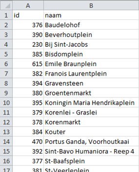
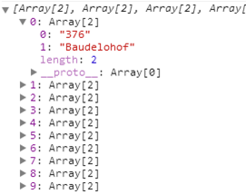
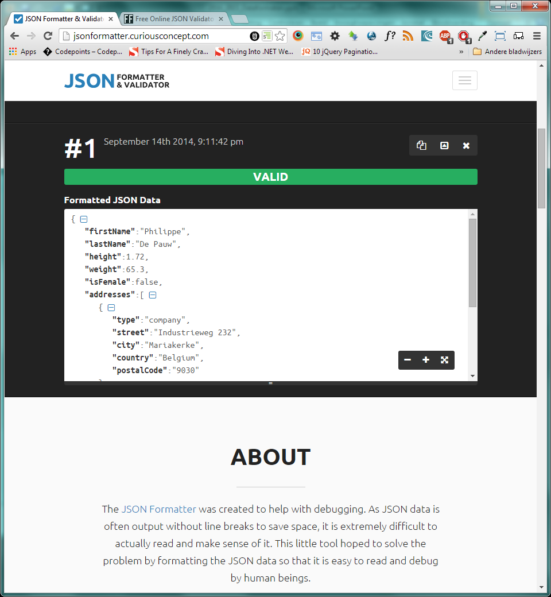
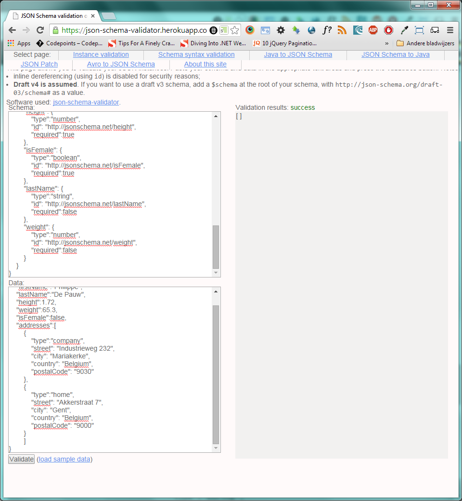
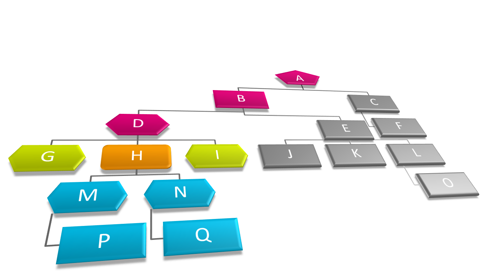
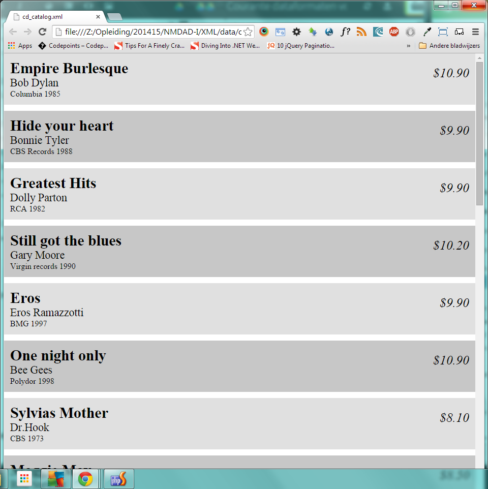

Courante dataformaten voor het web
=======================================

|Info|  |
|----|---|
|Olod|New Media Design & Development I|
|Auteur(s)|Philippe De Pauw - Waterschoot, Jonas Pottie|
|Opleiding|Bachelor in de Grafische en digitale media|
|Academiejaar|2015-16|

***

CSV
---

CSV staat voor Comma-seperated values of character-seperated values. CSV wordt vaak omschreven als *Tabular* data in *plain text* vorm. Bevat geen algemene standaard, maar een paar suggesties worden aangeboden via RFC4180. CSV bestaat uit een verzameling van records (rijen) gescheiden door een *line break* of iets gelijkaardigs. Meestal hebben alle records hetzelfde aantal velden. Ieder record bestaat uit een aantal velden gesepareerd door een comma of iets gelijkaardigs, bijv: `tab`, `;` , ... . 

Beschikbaar in vele applicaties via import/export functionaliteiten. Incompatibele programma*™s kunnen via CSV data met elkaar uitwisselen, bijv.: export van gegevens uit een databank en vervolgens import van deze gegevens via CSV in een spreadsheet.

Enkele vooropgestelde regels om CSV op te stellen:

- **Plain text** gebruik makend van een **character set**, zoals: ASCII en Unicode
- Bestaat uit records, meestal één record per regel
- Een record wordt onderverdeeld in velden
- De velden worden gescheiden via een **delimiter** of **separator**
- Elk record bestaat uit hetzelfde aantal velden

Deze regels zijn weliswaar niet vastgelegd in een standaard, maar worden toch algemeen aangenomen.

> **CSV Voorbeeld Locaties Gentse Feesten**
> 
>
>

Vie het XMLHttpRequest object kunnen we o.a. externe CSV bestanden inladen.``

```
var csvURL = 'http://datatank.gent.be/Cultuur-Sport-VrijeTijd/GentseFeestenLocaties.csv';

var req = new XMLHttpRequest();
req.open('GET', csvURL, true);
req.onreadystatechange = function (ev) {
  if (req.readyState == 4) {
      if(req.status == 200) {
          var records = req.responseText.replace(/"/g, '').split('\n');
          var resultArray = [];
          for(var i = 1;i<records.length;i++){
            resultArray.push(records[i].split(';'));
          }     
          console.log(resultArray);
      }
      else {
          console.log("Error loading page\n");
      }      
  }
};
req.send(null);
```

> **Resultaat in het console-venster**
>
>
>

We kunnen het bovenstaande voorbeeld nog meer object georiënteerd maken door een rij te converteren naar een object en de labels uit de eerste rij van het csv-bestand te gebruiken als namen voor de eigenschappen van het object.

```
if(req.status == 200) {
          var records = req.responseText.replace(/"/g, '').split('\n');
          var properties = records[0].split(';');
          var resultArray = [], tempArray = null, obj = null;
          for(var i = 1;i<records.length;i++){
            tempArray = records[i].split(';');
            obj = new Object();
            for(var j=0;j<tempArray.length;j++){
              obj[properties[j]] = tempArray[j];
            }
            resultArray.push(obj);
          }     
          console.log(resultArray);
      }
```

JSON
----

JSON staat voor JavaScript Object Notation en wordt uitgesproken als "Jason". Werd voor het eerst gespecificeerd door Douglas Crockford, daarna door RFC 7159 en ECMA-404. JSON-bestand is leesbare tekst om dataobjecten te versturen bestaande uit **key(attribute)/value** pairs. Het wordt tegenwoordig gebruikt als alternatief voor XML. Het is gelijkaardig met de **Literal notation** van een object in JavaScript.

JSON is taal-onafhankelijk waardoor het door bijna alle programmeertalen kan gelezen en gegenereerd worden. JSON-bestanden zijn herkenbaar door de extensie: `.json`.  Het mediatype van een JSON bestand is `application/json`. Indien we het JSON-bestand inladen m.b.v. een "callback-functie", dan is het mediatype hiervan `application/javascript`.

```
{
	key1:value1,
	key2:value2,
	*¦
}
```

JSON bevat de volgende vorm:

- Een object is een ongeordende lijst van **key/value** paren en begint met een { en eindigt met een }
- Elke **key** wordt gevolgd door een : (dubbelpunt)
- De paren worden gescheiden door een , (comma)
- Een **key** is altijd een string en begint met een " en eindigt met een "
- De **value** kan de volgende **datatypen** bevatten: **string, number, object, array, boolean of null**

Een **Number** datatype is een positief- of negatief decimaal getal met een dubbele-precisie floating-point formaat (maximaal 9 digits). De exponentiële `E` notatie (`e, e+, e-, E, E+, E-`) wordt ook toegelaten.

```
"stock" : -1.659,
"speed" : 1.51E-6
```

De waarde 1.51E-6 komt overeen met de waarde 0.00000151. 

Een **Boolean** datatype bevat de waarde `true` of `false`.

```
"isFemale" : true
```

Een **Null** datatype vertegenwoordigt een lege waarde en bevat `null` als waarde.

```
"data" : null
```

Een **Array** datatype is een geordende lijst van waarden. Een Array kan `0 tot n` waarden bevatten. Een Array begint altijd met `[` en eindigt met een `]`. De waarden binnen een Array worden gescheiden door een comma `,`. Mogelijke datatypen voor een waarde: string, number, boolean, array, object of null.

```
"names" : ["Linus", "Bill", "Steve"]
```

Een **Object** datatype is een ongeordende associatieve array. Een associatieve array bevat "key/value" paren. Een object wordt omsloten door een `{` en `}`, zijnde curly brackets.

```
"address": {
    "street": "Industrieweg 232",
    "city": "Mariakerke",
    "country": "Belgium",
    "postalCode": "9000"
  }
```

Als voorbeeld gaan we een persoon declareren via JSON. Een persoon heeft een voornaam, familienaam, lengte, gewicht, geslacht, thuisadres en een werkadres.

```
{
    "firstName":"Philippe",
    "lastName":"De Pauw",
    "height":1.72,
    "weight":65.3,
    "isFemale":false,
    "addresses":[
        {
            "type":"company",
            "street": "Industrieweg 232",
            "city": "Mariakerke",
            "country": "Belgium",
            "postalCode": "9030"
        },
        {
            "type":"home",
            "street": "Akkerstraat 7",
            "city": "Gent",
            "country": "Belgium",
            "postalCode": "9000"
        }
        ]
}
```

Om JSON te valideren kunnen we dit realiseren o.a. via online services, zoals:

- <http://jsonlint.com/>
- <http://jsonformatter.curiousconcept.com/>
- <http://www.freeformatter.com/json-validator.html>
- <https://json-schema-validator.herokuapp.com/> (inclusief JSON Schema)




Naast het gebruik van deze online services kunnen we natuurlijk JSON nakijken of deze goed opgebouwd (well-formedness) is via JavaScript.

```
function IsJSONStringWellformed(strJSON){
    try{
        var o = JSON.parse(strJSON);
        if (o && typeof o === "object" && o !== null) {
            return true;
        } 
        return false;
    }
    catch(e){
    }
    return false;
}

var jsonString = '{"firstName":Philippe","lastName":"De Pauw"}';
console.log(IsJSONStringWellformed(jsonString));
```

Via de statische methode `parse(bepaalde string)` uit de klasse `JSON` kunnen we een JSON-string converteren naar een JSON-object. De bovenstaande code geeft in het console-venster de waarde `false`, omdat de waarde `Philippe"` een dubbele aanhalingsteken `"` ontbreekt. De juiste waarde moet dus zijn: `"Philippe"`.

De code van hierboven kunnen we nog korter schrijven door gebruik te maken van een reguliere expressie. We kunnen ook de globale functie `eval(bepaalde string)` als alternatief voor `JSON.parse(bepaalde string)`, bij voorkeur de laatste methode gebruiken.

```
function IsJSONStringWellformed(strJSON){
    var isSyntaxOk = !(/[^,:{}\[\]0-9.\-+Eaeflnr-u \n\r\t]/.test(strJSON.replace(/"(\\.|[^"\\])*"/g, '')));
    if(isSyntaxOk){
        var o = JSON.parse(strJSON);
        if (o && typeof o === "object" && o !== null) {
            return true;
        } 
    }
    return false;
}

var jsonString = '{"firstName":Philippe","lastName":"De Pauw"}';
console.log(IsJSONStringWellformed(jsonString));
```

Om JSON effectief te valideren moeten we gebruik maken van JSON Schema. Dit is gelijkaardig met DTD en XMLSchema om XML documenten te valideren. JSON Schema beschrijft dus een bepaald JSON dataformaat. JSON Schema is op zichzelf ook JSON. Het geeft ook een complete structurele validatie.

```
{
	"type":"object",
	"$schema": "http://json-schema.org/draft-03/schema",
	"id": "http://jsonschema.net",
	"required":false,
	"properties":{
		"addresses": {
			"type":"array",
			"id": "http://jsonschema.net/addresses",
			"required":false,
			"items":
				{
					"type":"object",
					"id": "http://jsonschema.net/addresses/0",
					"required":false,
					"properties":{
						"city": {
							"type":"string",
							"id": "http://jsonschema.net/addresses/0/city",
							"required":true
						},
						"country": {
							"type":"string",
							"id": "http://jsonschema.net/addresses/0/country",
							"required":true
						},
						"postalCode": {
							"type":"string",
							"id": "http://jsonschema.net/addresses/0/postalCode",
							"required":false
						},
						"street": {
							"type":"string",
							"id": "http://jsonschema.net/addresses/0/street",
							"required":true
						},
						"type": {
							"type":"string",
							"id": "http://jsonschema.net/addresses/0/type",
							"required":false
						}
					}
				}
			

		},
		"firstName": {
			"type":"string",
			"id": "http://jsonschema.net/firstName",
			"required":true
		},
		"height": {
			"type":"number",
			"id": "http://jsonschema.net/height",
			"required":true
		},
		"isFemale": {
			"type":"boolean",
			"id": "http://jsonschema.net/isFemale",
			"required":true
		},
		"lastName": {
			"type":"string",
			"id": "http://jsonschema.net/lastName",
			"required":false
		},
		"weight": {
			"type":"number",
			"id": "http://jsonschema.net/weight",
			"required":false
		}
	}
}
```

> JSON validatie m.b.v. JSON Schema via https://json-schema-validator.herokuapp.com/
>
>

##JSONP

JSONP of JSON-P staat voor JSON met padding. Het is een manier om data te halen uit een ander domein zonder de CORS-regels toe te passen. CORS (Cross Origin Resource Sharing) is een verzameling van regels om data tussen websites te versturen die een verschillend domein hebben. JSONP werd ontwikkeld om data te kunnen verkrijgen uit een verschillend domein. Aanmaak, wijzigen of verwijderen van data wordt door JSONP niet ondersteund.

```
Aanvraag URL:
http://www.abc.com/data.json?callback=de
```

De URL om JSON te verkrijgen wordt aangevuld met een query parameter `callback`. Deze parameter bevat als waarde de naam van de functie die uitgevoerd moet worden wanneer de server data terugstuurt.

```
JSONP response:

de({
	"firstName":"Philippe",
	"surName":"De Pauw"
});
```

Via het XMLHttpRequest object kunnen we geen JSONP aanvragen uitvoeren. JSONP kunnen we enkel laden via `<script>`-tag of via externe bibliotheken, zoals jQuery, AngularJS, ... .

```
function loadJSONP(url){

  var script = document.createElement('script');
  script.src = url;
  
  script.onload = function () {
    this.remove();
  };//After scripts is loaded and executed, remoe it from the DOM 
  
  var head = document.getElementsByTagName('head')[0];
  head.insertBefore(script);//Insert script into the DOM
}

function processJSONP(data){
  var channel = data.query.results.channel;
  document.querySelector('.weather').innerHTML = 
    'The temperature in ' + 
    channel.location.city + ', ' +
    channel.location.country + ' is ' +
    channel.item.condition.temp + '&deg; ' + 
    channel.units.temperature;
}

var url = 'https://query.yahooapis.com/v1/public/yql?q=select%20*%20from%20weather.forecast%20where%20woeid%3D12591774&format=json&diagnostics=true&callback=processJSONP';
loadJSONP(url);
```

In de functie `loadJSONP(url)` generen we een `<script>` dynamisch waarvan de waarde van het `src`-attribuut gelijk is aan de waarde van de opgegeven URL.  Door injectie van dit script in de DOM zal de URL ingeladen worden. De callback functie `processJSONP(data)` zal vervolgens uitgevoerd worden wanneer we data ontvangen. In deze functie doorlopen we het JSON-object en genereren we HTML-inhoud in de container `.weather`.

XML
---

XML staat voor eXtensible Markup Language. Het is een uitbreidbare opmaaktaal, dus geen programmeertaal! Wordt voornamelijk gebruikt voor de opslag en uitwisseling van gegevens. Doordat het een W3C[^w3c]-standaard is, kan dit op een betrouwbare en relatief eenvoudige manier.

XML is een tekstdocument met daarin elementen.
Een element is een basiseenheid die bestaat uit gegevens met opmaak. De opmaak gebeurt door middel van tags die de gegevens beschrijven.

XML is dus net als HTML een opmaaktaal. XML is niet zomaar een opmaaktaal, maar een metaopmaaktaal:

- Geen vaste set met tags die in alle situaties werken. Ontwikkelaars moeten zelf tags definiëren. XML bevat dus geen voorgedefinieerde tags.
- Beschrijven van data en dus geen weergave of visualisatie van data. XML is complementair met HTML.
- XML kan als basis voor een opmaaktaal gebruikt worden:
	- **XHTML**
Extensible HyperText Markup Language
	- **SVG**
Scalable Vector Graphics
Adobe LiveMotion (2000), nu ondersteund door alle recente browsers.
	- **RDF**
Resource Description Framework
Standaard voor uitwisselen van gegevens.
	- **RSS**
Really Simple Syndication

Andere bekende XML-gebaseerde formaten:

- **OOXML**
Office Open XML, zoals: .docx, xslx, pptx (zip-bestand met XML-bestandan erin)
- **COLLADA**
COLLAborative Design Activity. 3D-bestanden uitwisselen tussen applicaties
- **EPUB**
Electronic PUBlication, voornamelijk gebruikt bij E-books.
- **...**

###Eenvoudig XML-document

De eerste regel in een XML-document is de verwerkingsinstructie `<?xml  ?>`. Declareert een tekstdocument als een XML-document. We vertellen ook hierin welke versie van XML we gebruiken alsook de tekenset- of codering welke we zullen toepassen. Mogelijke tekencoderingen:

- UTF-8
8-bit Unicode Transformation Format
- UTF-16
16-bit Unicode Transformation Format
- ISO-8859-1
Latin Alphabet 1 (Western Europe).

```xml
<?xml version="1.0"   
      encoding="utf-8"?>
<!-- Dit is commentaar in XML -->
```

Meestal gebruiken we versie 1.0 van de XML-standaard en de tekencodering UTF-8. Commentaar schrijven we op dezelfde manier als in (X)HTML: `<!-- commentaar -->`.

Vervolgens bepalen we in het XML-document het root-element. Er mag slechts één root-element aanwezig zijn. Alle andere inhoud zit vervat tussen dit root-element. De sluit- of end-tag van dit root-element is dan ook de laatste tag van het XML-document. Een element kan bevatten:

- andere elementen
- tekst
- attributen
- een mix van al het voorgaande.

```xml
<?xml version="1.0"   
      encoding="UTF-8"?>
<persons>
</persons>
```

In het bovenstaande voorbeeld fungeert `<persons>` als root-element van het XML-document. Dit element zal in ons voorbeeld alle personen bevatten.

```xml
<?xml version="1.0"   
      encoding="UTF-8"?>
<persons>
	<person id="1" />
	<person id="2" />
</persons>
```

Het element `person` is een child-element van `persons`. Het element `persons` is het parent-element van alle `person`-elementen. `id` is een attribuut van een element `person` en heeft als waarde `1` voor de eerste persoon en `2` voor de tweede persoon. Dit attribuut correspondeert met de primaire sleutel in de tabel `persons` in een databank. **Attributen geven additionele informatie of metadata aan een element**. Attributen bevatten geen boomstructuur waardoor ze moeilijk uitbreidbaar zijn. De eerste persoon is een broer of zus van de tweede persoon en ook omgekeerd. Deze relatie is ook beter gekend als een **sibling**.

> **XML hiërarchie**
>  
>
>
> Element **H** heeft **twee sibling-elementen**: **G** en **H**. **H** heeft **drie ancestor-elementen**: **D** (parent-element), **B** en **A** (root-element). **H** heeft **vier descendant-elementen**: **M** en **N** zijn **child-elementen**, **P** en **Q** zijn gewone **descendant-elementen**.

###Welgevormde XML

Een XML-document is welgevormd indien:

- het één root-element bevat
- elementen altijd voorzien worden van een begin- en eindtag, bv.: `<person>...</person>`, behalve bij unaire of zelfsluitende tags `<br />`
- child-elementen op een juiste manier vervat zitten in een parent-element
- begin-en eindtag dezelfde karakters bevatten, want XML is hoofdlettergevoelig, bv.: `<person>` is niet hetzelfde als `<Person>` of `<PERSON>`
- enkel tekens toegepast worden die toegelaten zijn: alle alfanumerieke tekens, ideogrammen en leestekens `-, _, . en :`
- geen spaties voorzien worden in de naamgeving van elementen en attributen
- de naamgeving van elementen en attributen niet beginnen met een cijfer, koppelteken, punt of dubbelpunt. Underscore wordt wel toegelaten als startkarakter
-  `--` niet voorkomt in een commentaarregel
- de verwerkingsinstructie staat binnen `<?` en `?>`
- attributen van eenzelfde element een unieke naam hebben
- de waarde van een attribuut omsloten wordt door dubbele rechte aanhalingstekens `"`
- gereserveerde tekens (`>, <, &, ', "`) als inhoud van een element vervangen worden door de corresponderende entiteitsverwijzingen (`&gt;,&lt;,&amp;, &apos;, &quot;`)
- inhoud die niet geëvalueerd zal worden als onderdeel van de XML-structuur omsluiten door character data, een bijzondere sectie `<![CDATA[...]]>`.

```xml
<?xml version="1.0" encoding="UTF-8"?>
<persons>
	<person id="1">
		<firstName>Philippe</firstName>
		<surName>De Pauw</surName>
		<gender>Male</gender>
		<description>
			<![CDATA[
				<p>Een <strong>moderne</strong> professor. Veeleisend en streng, maar toch <em>rechtvaardig</em></p>
			]]>
		</description>
		<addresses>
			<address type="home">
				<street>Akkerstraat 7</street>
				<city postalCode="9000">Gent</city>
				<country>Belgium</country>
			</address>
			<address type="work">
				<street>Industrieweg 232</street>
				<city postalCode="9030">Mariakerke</city>
				<country>Belgium</country>
			</address>
		</addresses>
	</person>
	<person id="2">
		...
	</person>
</persons>
```

Enekele online well-formedness checkers:

- <http://www.w3schools.com/xml/xml_validator.asp>
- <http://www.xmlvalidation.com/>
- <http://www.utilities-online.info/xsdvalidation/#.VBgN1_l_sR0>
- <http://www.validome.org/xml/>
- <http://validator.w3.org/check>
- <http://www.freeformatter.com/xml-validator-xsd.html>
- <http://schneegans.de/sv/>
- <http://xmlvalidator.new-studio.org/>


###CSS en XML

Met CSS kunnen we displayinformatie toevoegen aan een XML-document. In de praktijk wordt dit weinig toegepast. W3C beveelt XSLT aan om XML-documenten te transformeren naar HTML met CSS.

```xml
<?xml version="1.0" encoding="UTF-8"?>
<?xml-stylesheet type="text/css" href="../styles/cd_catalog.css"?>
<!-- Edited by XMLSpy -->
<CATALOG>
	<CD>
		<TITLE>Empire Burlesque</TITLE>
		<ARTIST>Bob Dylan</ARTIST>
		<COUNTRY>USA</COUNTRY>
		<COMPANY>Columbia</COMPANY>
		<PRICE>10.90</PRICE>
		<YEAR>1985</YEAR>
	</CD>
	...
</CATALOG>
```

Net na de verwerkingsinstructie linken we een extern stijlbestand via `<?xml-stylesheet ... ?>`. Geeft ook het type van stijlbestand op via het type-attribuut. Het pad naar het stijlbestand wordt bekeken vanaf de locatie van het XML-bestand.

```css
CATALOG{
    font-size:16px;
    font-weight:normal;
}
CATALOG>CD{
    position:relative;
    display:block;
    padding:12px 36px 12px 12px;
    background:#e0e0e0;
    margin:0 0 12px;
}
CATALOG>CD:nth-of-type(even){
    background:#c7c7c7;
}
CATALOG>CD>TITLE{
    display:block;
    font-weight:800;
    font-size:1.86em;
}
CATALOG>CD>ARTIST{
    display:block;
    font-weight:600;
    font-size:1.36em;
}
CATALOG>CD>COUNTRY{
    display:none;
}
CATALOG>CD>PRICE{
    position:absolute;
    right:12px;
    top:24px;
    font-size:1.62em;
    font-style: italic;
}
CATALOG>CD>PRICE::before{
    content:'$';
}
```

De namen van de elementen in het XML-document doen ook dienst als naam van de corresponderende selectors.


> **De output in het browservenster:**
>
>


###XPath

XPath wordt gebruikt om te navigeren doorheen de elementen en attributen in een XML-document. XPath is onmisbaar in XSLT.

XPath gebruikt pad-expressies om knopen of verzamelingen vab knopen te selecteren in een XML-document. XPath bevat ongeveer een 100-tal ingebouwde functies: functies voor string-waarden en numerieke waarden, datum en tijd vergelijkingen, knoopmanipulatie, ... . XQuery en XPointer zijn een uitbreiding op XPath-expressies.


###Geldige XML-documenten

Een geldig of valid XML-document is verschillend van een well-formed XML-document. Een welgevormd XML-document is een XML-document dat de juiste syntaxis bevat. Daarnaast moeten zowel de inhoud als de structuur correct zijn. Deze moeten conform zijn met een documenttype. Een documenttype bevat regels om legale elementen en attributen te definiëren. Een documenttype wordt vaak omschreven als een documentdefinitie of documentschema. Enkele regels in een notendop:

- Zijn de elementen en attributen correct?
- Ontbreken er geen verplichte elementen?
- Staan er alleen elementen in die mogen?
- Staan er geen overbodige elementen in?
- Voldoet het element aan randvoorwaarden?
- Klopt het datatype?

De documentdefinitie bevat twee verschillende typen:

- DTD
Document Type Definition. Is zelf geen XML-document.
- XML Schema
Vervangt DTD en is zelf een XML-document.

XML Schema definieert:

- elementen die een document kunnen voorkomen
- attributen die in een document kunnen voorkomen
- welke elementen child-elementen zijn
- de volgorde van child-elementen
- het aantal child-elementen
- of een element leeg of tekst kan bevatten
- datatypen voor attrubuten en elementen
- standaard en constante waarden voor elementen en attributen

XML Schema heeft als extensie `.xsd`. De naamruimte wordt bepaald door `xmlns:xs`. `xs` is de naam van de naamruimte en is vrij te kiezen.

```xml
persons.xsd:

<?xml version="1.0"?>
<xs:schema xmlns:xs="http://www.w3.org/2001/XMLSchema">
</xs:schema>
```

We kunnen dit XML Schema nu linken in het XML-document via speciale attributen van het root-element.

```xml
persons.xml:

<?xml version="1.0"?>
<persons 
xmlns:xsi="http://www.w3.org/2001/XMLSchema-instance"  xsi:noNamespaceSchemaLocation="persons.xsd">

</persons>
```

De bovenstaande XML-code gaat ervan uit dat het XML Schema mee zal verstuurd worden met het XML-document via het attribuut `xsi:noNamespaceSchemaLocation` opgegeven. 

```xml
persons.xml:

<?xml version="1.0"?>
<persons 
xmlns="http://www.arteveldehogeschool.be"
xmlns:xsi="http://www.w3.org/2001/XMLSchema-instance"  xsi:schemaLocation="http://www.arteveldehogeschool.be persons.xsd">

</persons>
```

Bibliografie
--------------

> **CSV**
>
> - http://en.wikipedia.org/wiki/Comma-separated_values
- http://tools.ietf.org/html/rfc4180

> **JSON**
> 
> - http://en.wikipedia.org/wiki/Json
- http://json.org/
- http://www.ecma-international.org/publications/files/ECMA-ST/ECMA-404.pdf
- http://json-schema.org/
- https://developer.mozilla.org/en-US/docs/Web/JavaScript/Reference/Global_Objects/eval
- https://developer.mozilla.org/en-US/docs/Web/JavaScript/Reference/Global_Objects/JSON

> **JSONP**
>
> - http://en.wikipedia.org/wiki/JSONP
- http://json-p.org/
- http://www.ibm.com/developerworks/library/wa-aj-jsonp1/
- http://en.wikipedia.org/wiki/Cross-origin_resource_sharing
- http://cameronspear.com/blog/exactly-what-is-jsonp/

>**XML**
>
> - http://www.xmlfiles.com/examples/
> - http://www.w3schools.com/xml/default.asp
> - http://www.w3schools.com/schema/schema_intro.asp
> 

[^w3c]: W3C: World Wide Web Consortium
http://www.w3.org/standards/xml/