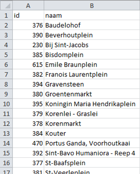
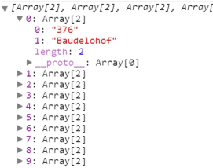
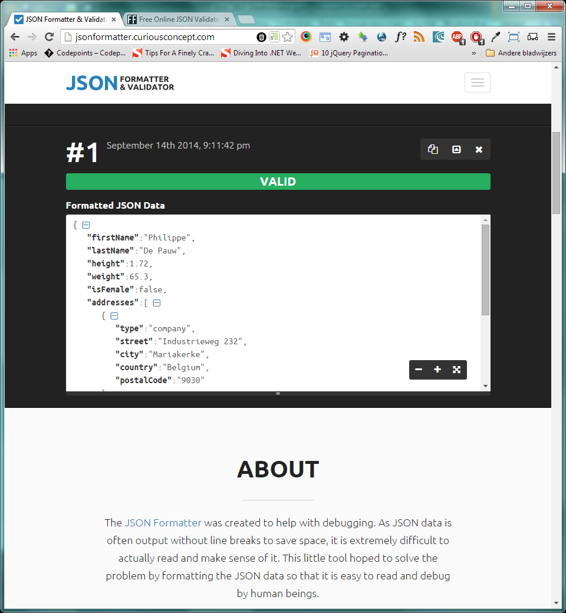
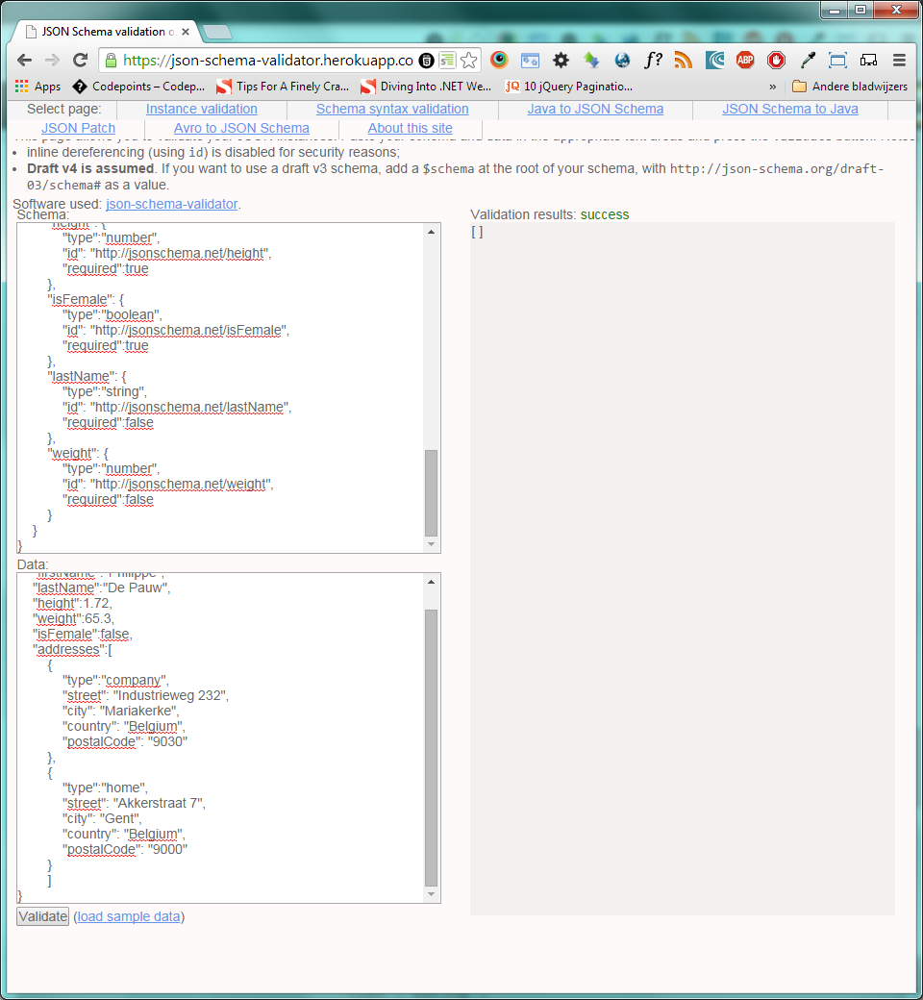
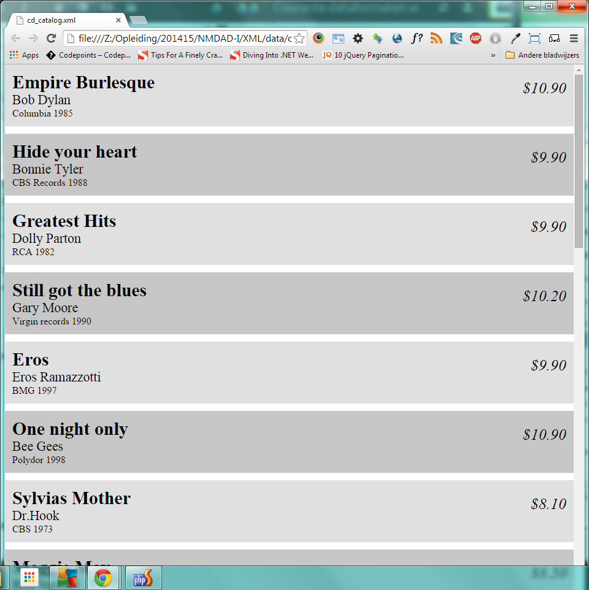

Werken met data
===============

|Info|  |
|----|---|
|Olod|New Media Design & Development I|
|Auteur(s)|Philippe De Pauw - Waterschoot, Jonas Pottie|
|Opleiding|Bachelor in de Grafische en digitale media|
|Academiejaar|2015-16|

***

Courante dataformaten voor het web
----------------------------------

###CSV

CSV staat voor Comma-seperated values of character-seperated values. CSV wordt vaak omschreven als *Tabular* data in *plain text* vorm. Bevat geen algemene standaard, maar een paar suggesties worden aangeboden via RFC4180. CSV bestaat uit een verzameling van records (rijen) gescheiden door een *line break* of iets gelijkaardigs. Meestal hebben alle records hetzelfde aantal velden. Ieder record bestaat uit een aantal velden gesepareerd door een comma of iets gelijkaardigs, bijv: `tab`, `;` , ... . 

Beschikbaar in vele applicaties via import/export functionaliteiten. Incompatibele programma*™s kunnen via CSV data met elkaar uitwisselen, bijv.: export van gegevens uit een databank en vervolgens import van deze gegevens via CSV in een spreadsheet.

Enkele vooropgestelde regels om CSV op te stellen:

- **Plain text** gebruik makend van een **character set**, zoals: ASCII en Unicode
- Bestaat uit records, meestal één record per regel
- Een record wordt onderverdeeld in velden
- De velden worden gescheiden via een **delimiter** of **separator**
- Elk record bestaat uit hetzelfde aantal velden

Deze regels zijn weliswaar niet vastgelegd in een standaard, maar worden toch algemeen aangenomen.

> **CSV Voorbeeld Locaties Gentse Feesten**
> 
>
>

Vie het XMLHttpRequest object kunnen we o.a. externe CSV bestanden inladen.``

```
var csvURL = 'http://datatank.gent.be/Cultuur-Sport-VrijeTijd/GentseFeestenLocaties.csv';

var req = new XMLHttpRequest();
req.open('GET', csvURL, true);
req.onreadystatechange = function (ev) {
  if (req.readyState == 4) {
      if(req.status == 200) {
          var records = req.responseText.replace(/"/g, '').split('\n');
          var resultArray = [];
          for(var i = 1;i<records.length;i++){
            resultArray.push(records[i].split(';'));
          }     
          console.log(resultArray);
      }
      else {
          console.log("Error loading page\n");
      }      
  }
};
req.send(null);
```

> **Resultaat in het console-venster**
>
>
>

We kunnen het bovenstaande voorbeeld nog meer object georiënteerd maken door een rij te converteren naar een object en de labels uit de eerste rij van het csv-bestand te gebruiken als namen voor de eigenschappen van het object.

```
if(req.status == 200) {
          var records = req.responseText.replace(/"/g, '').split('\n');
          var properties = records[0].split(';');
          var resultArray = [], tempArray = null, obj = null;
          for(var i = 1;i<records.length;i++){
            tempArray = records[i].split(';');
            obj = new Object();
            for(var j=0;j<tempArray.length;j++){
              obj[properties[j]] = tempArray[j];
            }
            resultArray.push(obj);
          }     
          console.log(resultArray);
      }
```

###JSON

JSON staat voor JavaScript Object Notation en wordt uitgesproken als "Jason". Werd voor het eerst gespecificeerd door Douglas Crockford, daarna door RFC 7159 en ECMA-404. JSON-bestand is leesbare tekst om dataobjecten te versturen bestaande uit **key(attribute)/value** pairs. Het wordt tegenwoordig gebruikt als alternatief voor XML. Het is gelijkaardig met de **Literal notation** van een object in JavaScript.

JSON is taal-onafhankelijk waardoor het door bijna alle programmeertalen kan gelezen en gegenereerd worden. JSON-bestanden zijn herkenbaar door de extensie: `.json`.  Het mediatype van een JSON bestand is `application/json`. Indien we het JSON-bestand inladen m.b.v. een "callback-functie", dan is het mediatype hiervan `application/javascript`.

```
{
	key1:value1,
	key2:value2,
	*¦
}
```

JSON bevat de volgende vorm:

- Een object is een ongeordende lijst van **key/value** paren en begint met een { en eindigt met een }
- Elke **key** wordt gevolgd door een : (dubbelpunt)
- De paren worden gescheiden door een , (comma)
- Een **key** is altijd een string en begint met een " en eindigt met een "
- De **value** kan de volgende **datatypen** bevatten: **string, number, object, array, boolean of null**

Een **Number** datatype is een positief- of negatief decimaal getal met een dubbele-precisie floating-point formaat (maximaal 9 digits). De exponentiële `E` notatie (`e, e+, e-, E, E+, E-`) wordt ook toegelaten.

```
"stock" : -1.659,
"speed" : 1.51E-6
```

De waarde 1.51E-6 komt overeen met de waarde 0.00000151. 

Een **Boolean** datatype bevat de waarde `true` of `false`.

```
"isFemale" : true
```

Een **Null** datatype vertegenwoordigt een lege waarde en bevat `null` als waarde.

```
"data" : null
```

Een **Array** datatype is een geordende lijst van waarden. Een Array kan `0 tot n` waarden bevatten. Een Array begint altijd met `[` en eindigt met een `]`. De waarden binnen een Array worden gescheiden door een comma `,`. Mogelijke datatypen voor een waarde: string, number, boolean, array, object of null.

```
"names" : ["Linus", "Bill", "Steve"]
```

Een **Object** datatype is een ongeordende associatieve array. Een associatieve array bevat "key/value" paren. Een object wordt omsloten door een `{` en `}`, zijnde curly brackets.

```
"address": {
    "street": "Industrieweg 232",
    "city": "Mariakerke",
    "country": "Belgium",
    "postalCode": "9000"
  }
```

Als voorbeeld gaan we een persoon declareren via JSON. Een persoon heeft een voornaam, familienaam, lengte, gewicht, geslacht, thuisadres en een werkadres.

```
{
    "firstName":"Philippe",
    "lastName":"De Pauw",
    "height":1.72,
    "weight":65.3,
    "isFemale":false,
    "addresses":[
        {
            "type":"company",
            "street": "Industrieweg 232",
            "city": "Mariakerke",
            "country": "Belgium",
            "postalCode": "9030"
        },
        {
            "type":"home",
            "street": "Akkerstraat 7",
            "city": "Gent",
            "country": "Belgium",
            "postalCode": "9000"
        }
        ]
}
```

Om JSON te valideren kunnen we dit realiseren o.a. via online services, zoals:

- <http://jsonlint.com/>
- <http://jsonformatter.curiousconcept.com/>
- <http://www.freeformatter.com/json-validator.html>
- <https://json-schema-validator.herokuapp.com/> (inclusief JSON Schema)




Naast het gebruik van deze online services kunnen we natuurlijk JSON nakijken of deze goed opgebouwd (well-formedness) is via JavaScript.

```
function IsJSONStringWellformed(strJSON){
    try{
        var o = JSON.parse(strJSON);
        if (o && typeof o === "object" && o !== null) {
            return true;
        } 
        return false;
    }
    catch(e){
    }
    return false;
}

var jsonString = '{"firstName":Philippe","lastName":"De Pauw"}';
console.log(IsJSONStringWellformed(jsonString));
```

Via de statische methode `parse(bepaalde string)` uit de klasse `JSON` kunnen we een JSON-string converteren naar een JSON-object. De bovenstaande code geeft in het console-venster de waarde `false`, omdat de waarde `Philippe"` een dubbele aanhalingsteken `"` ontbreekt. De juiste waarde moet dus zijn: `"Philippe"`.

De code van hierboven kunnen we nog korter schrijven door gebruik te maken van een reguliere expressie. We kunnen ook de globale functie `eval(bepaalde string)` als alternatief voor `JSON.parse(bepaalde string)`, bij voorkeur de laatste methode gebruiken.

```
function IsJSONStringWellformed(strJSON){
    var isSyntaxOk = !(/[^,:{}\[\]0-9.\-+Eaeflnr-u \n\r\t]/.test(strJSON.replace(/"(\\.|[^"\\])*"/g, '')));
    if(isSyntaxOk){
        var o = JSON.parse(strJSON);
        if (o && typeof o === "object" && o !== null) {
            return true;
        } 
    }
    return false;
}

var jsonString = '{"firstName":Philippe","lastName":"De Pauw"}';
console.log(IsJSONStringWellformed(jsonString));
```

Om JSON effectief te valideren moeten we gebruik maken van JSON Schema. Dit is gelijkaardig met DTD en XMLSchema om XML documenten te valideren. JSON Schema beschrijft dus een bepaald JSON dataformaat. JSON Schema is op zichzelf ook JSON. Het geeft ook een complete structurele validatie.

```
{
	"type":"object",
	"$schema": "http://json-schema.org/draft-03/schema",
	"id": "http://jsonschema.net",
	"required":false,
	"properties":{
		"addresses": {
			"type":"array",
			"id": "http://jsonschema.net/addresses",
			"required":false,
			"items":
				{
					"type":"object",
					"id": "http://jsonschema.net/addresses/0",
					"required":false,
					"properties":{
						"city": {
							"type":"string",
							"id": "http://jsonschema.net/addresses/0/city",
							"required":true
						},
						"country": {
							"type":"string",
							"id": "http://jsonschema.net/addresses/0/country",
							"required":true
						},
						"postalCode": {
							"type":"string",
							"id": "http://jsonschema.net/addresses/0/postalCode",
							"required":false
						},
						"street": {
							"type":"string",
							"id": "http://jsonschema.net/addresses/0/street",
							"required":true
						},
						"type": {
							"type":"string",
							"id": "http://jsonschema.net/addresses/0/type",
							"required":false
						}
					}
				}
			

		},
		"firstName": {
			"type":"string",
			"id": "http://jsonschema.net/firstName",
			"required":true
		},
		"height": {
			"type":"number",
			"id": "http://jsonschema.net/height",
			"required":true
		},
		"isFemale": {
			"type":"boolean",
			"id": "http://jsonschema.net/isFemale",
			"required":true
		},
		"lastName": {
			"type":"string",
			"id": "http://jsonschema.net/lastName",
			"required":false
		},
		"weight": {
			"type":"number",
			"id": "http://jsonschema.net/weight",
			"required":false
		}
	}
}
```

> JSON validatie m.b.v. JSON Schema via https://json-schema-validator.herokuapp.com/
>
>

###JSONP

JSONP of JSON-P staat voor JSON met padding. Het is een manier om data te halen uit een ander domein zonder de CORS-regels toe te passen. CORS (Cross Origin Resource Sharing) is een verzameling van regels om data tussen websites te versturen die een verschillend domein hebben. JSONP werd ontwikkeld om data te kunnen verkrijgen uit een verschillend domein. Aanmaak, wijzigen of verwijderen van data wordt door JSONP niet ondersteund.

```
Aanvraag URL:
http://www.abc.com/data.json?callback=de
```

De URL om JSON te verkrijgen wordt aangevuld met een query parameter `callback`. Deze parameter bevat als waarde de naam van de functie die uitgevoerd moet worden wanneer de server data terugstuurt.

```
JSONP response:

de({
	"firstName":"Philippe",
	"surName":"De Pauw"
});
```

Via het XMLHttpRequest object kunnen we geen JSONP aanvragen uitvoeren. JSONP kunnen we enkel laden via `<script>`-tag of via externe bibliotheken, zoals jQuery, AngularJS, ... .

```
function loadJSONP(url){

  var script = document.createElement('script');
  script.src = url;
  
  script.onload = function () {
    this.remove();
  };//After scripts is loaded and executed, remoe it from the DOM 
  
  var head = document.getElementsByTagName('head')[0];
  head.insertBefore(script);//Insert script into the DOM
}

function processJSONP(data){
  var channel = data.query.results.channel;
  document.querySelector('.weather').innerHTML = 
    'The temperature in ' + 
    channel.location.city + ', ' +
    channel.location.country + ' is ' +
    channel.item.condition.temp + '&deg; ' + 
    channel.units.temperature;
}

var url = 'https://query.yahooapis.com/v1/public/yql?q=select%20*%20from%20weather.forecast%20where%20woeid%3D12591774&format=json&diagnostics=true&callback=processJSONP';
loadJSONP(url);
```

In de functie `loadJSONP(url)` generen we een `<script>` dynamisch waarvan de waarde van het `src`-attribuut gelijk is aan de waarde van de opgegeven URL.  Door injectie van dit script in de DOM zal de URL ingeladen worden. De callback functie `processJSONP(data)` zal vervolgens uitgevoerd worden wanneer we data ontvangen. In deze functie doorlopen we het JSON-object en genereren we HTML-inhoud in de container `.weather`.

###XML

XML staat voor eXtensible Markup Language. Het is een uitbreidbare opmaaktaal, dus geen programmeertaal! Wordt voornamelijk gebruikt voor de opslag en uitwisseling van gegevens. Doordat het een W3C[^w3c]-standaard is, kan dit op een betrouwbare en relatief eenvoudige manier.

XML is een tekstdocument met daarin elementen.
Een element is een basiseenheid die bestaat uit gegevens met opmaak. De opmaak gebeurt door middel van tags die de gegevens beschrijven.

XML is dus net als HTML een opmaaktaal. XML is niet zomaar een opmaaktaal, maar een metaopmaaktaal:

- Geen vaste set met tags die in alle situaties werken. Ontwikkelaars moeten zelf tags definiëren. XML bevat dus geen voorgedefinieerde tags.
- Beschrijven van data en dus geen weergave of visualisatie van data. XML is complementair met HTML.
- XML kan als basis voor een opmaaktaal gebruikt worden:
	- **XHTML**
Extensible HyperText Markup Language
	- **SVG**
Scalable Vector Graphics
Adobe LiveMotion (2000), nu ondersteund door alle recente browsers.
	- **RDF**
Resource Description Framework
Standaard voor uitwisselen van gegevens.
	- **RSS**
Really Simple Syndication

Andere bekende XML-gebaseerde formaten:

- **OOXML**
Office Open XML, zoals: .docx, xslx, pptx (zip-bestand met XML-bestandan erin)
- **COLLADA**
COLLAborative Design Activity. 3D-bestanden uitwisselen tussen applicaties
- **EPUB**
Electronic PUBlication, voornamelijk gebruikt bij E-books.
- **...**

####Eenvoudig XML-document

De eerste regel in een XML-document is de verwerkingsinstructie `<?xml  ?>`. Declareert een tekstdocument als een XML-document. We vertellen ook hierin welke versie van XML we gebruiken alsook de tekenset- of codering welke we zullen toepassen. Mogelijke tekencoderingen:

- UTF-8
8-bit Unicode Transformation Format
- UTF-16
16-bit Unicode Transformation Format
- ISO-8859-1
Latin Alphabet 1 (Western Europe).

```xml
<?xml version="1.0"   
      encoding="utf-8"?>
<!-- Dit is commentaar in XML -->
```

Meestal gebruiken we versie 1.0 van de XML-standaard en de tekencodering UTF-8. Commentaar schrijven we op dezelfde manier als in (X)HTML: `<!-- commentaar -->`.

Vervolgens bepalen we in het XML-document het root-element. Er mag slechts één root-element aanwezig zijn. Alle andere inhoud zit vervat tussen dit root-element. De sluit- of end-tag van dit root-element is dan ook de laatste tag van het XML-document. Een element kan bevatten:

- andere elementen
- tekst
- attributen
- een mix van al het voorgaande.

```xml
<?xml version="1.0"   
      encoding="UTF-8"?>
<persons>
</persons>
```

In het bovenstaande voorbeeld fungeert `<persons>` als root-element van het XML-document. Dit element zal in ons voorbeeld alle personen bevatten.

```xml
<?xml version="1.0"   
      encoding="UTF-8"?>
<persons>
	<person id="1" />
	<person id="2" />
</persons>
```

Het element `person` is een child-element van `persons`. Het element `persons` is het parent-element van alle `person`-elementen. `id` is een attribuut van een element `person` en heeft als waarde `1` voor de eerste persoon en `2` voor de tweede persoon. Dit attribuut correspondeert met de primaire sleutel in de tabel `persons` in een databank. **Attributen geven additionele informatie of metadata aan een element**. Attributen bevatten geen boomstructuur waardoor ze moeilijk uitbreidbaar zijn. De eerste persoon is een broer of zus van de tweede persoon en ook omgekeerd. Deze relatie is ook beter gekend als een **sibling**.

> **XML hiërarchie**
>  
>
>
> Element **H** heeft **twee sibling-elementen**: **G** en **H**. **H** heeft **drie ancestor-elementen**: **D** (parent-element), **B** en **A** (root-element). **H** heeft **vier descendant-elementen**: **M** en **N** zijn **child-elementen**, **P** en **Q** zijn gewone **descendant-elementen**.

####Welgevormde XML

Een XML-document is welgevormd indien:

- het één root-element bevat
- elementen altijd voorzien worden van een begin- en eindtag, bv.: `<person>...</person>`, behalve bij unaire of zelfsluitende tags `<br />`
- child-elementen op een juiste manier vervat zitten in een parent-element
- begin-en eindtag dezelfde karakters bevatten, want XML is hoofdlettergevoelig, bv.: `<person>` is niet hetzelfde als `<Person>` of `<PERSON>`
- enkel tekens toegepast worden die toegelaten zijn: alle alfanumerieke tekens, ideogrammen en leestekens `-, _, . en :`
- geen spaties voorzien worden in de naamgeving van elementen en attributen
- de naamgeving van elementen en attributen niet beginnen met een cijfer, koppelteken, punt of dubbelpunt. Underscore wordt wel toegelaten als startkarakter
-  `--` niet voorkomt in een commentaarregel
- de verwerkingsinstructie staat binnen `<?` en `?>`
- attributen van eenzelfde element een unieke naam hebben
- de waarde van een attribuut omsloten wordt door dubbele rechte aanhalingstekens `"`
- gereserveerde tekens (`>, <, &, ', "`) als inhoud van een element vervangen worden door de corresponderende entiteitsverwijzingen (`&gt;,&lt;,&amp;, &apos;, &quot;`)
- inhoud die niet geëvalueerd zal worden als onderdeel van de XML-structuur omsluiten door character data, een bijzondere sectie `<![CDATA[...]]>`.

```xml
<?xml version="1.0" encoding="UTF-8"?>
<persons>
	<person id="1">
		<firstName>Philippe</firstName>
		<surName>De Pauw</surName>
		<gender>Male</gender>
		<description>
			<![CDATA[
				<p>Een <strong>moderne</strong> professor. Veeleisend en streng, maar toch <em>rechtvaardig</em></p>
			]]>
		</description>
		<addresses>
			<address type="home">
				<street>Akkerstraat 7</street>
				<city postalCode="9000">Gent</city>
				<country>Belgium</country>
			</address>
			<address type="work">
				<street>Industrieweg 232</street>
				<city postalCode="9030">Mariakerke</city>
				<country>Belgium</country>
			</address>
		</addresses>
	</person>
	<person id="2">
		...
	</person>
</persons>
```

Enekele online well-formedness checkers:

- <http://www.w3schools.com/xml/xml_validator.asp>
- <http://www.xmlvalidation.com/>
- <http://www.utilities-online.info/xsdvalidation/#.VBgN1_l_sR0>
- <http://www.validome.org/xml/>
- <http://validator.w3.org/check>
- <http://www.freeformatter.com/xml-validator-xsd.html>
- <http://schneegans.de/sv/>
- <http://xmlvalidator.new-studio.org/>


####CSS en XML

Met CSS kunnen we displayinformatie toevoegen aan een XML-document. In de praktijk wordt dit weinig toegepast. W3C beveelt XSLT aan om XML-documenten te transformeren naar HTML met CSS.

```xml
<?xml version="1.0" encoding="UTF-8"?>
<?xml-stylesheet type="text/css" href="../styles/cd_catalog.css"?>
<!-- Edited by XMLSpy -->
<CATALOG>
	<CD>
		<TITLE>Empire Burlesque</TITLE>
		<ARTIST>Bob Dylan</ARTIST>
		<COUNTRY>USA</COUNTRY>
		<COMPANY>Columbia</COMPANY>
		<PRICE>10.90</PRICE>
		<YEAR>1985</YEAR>
	</CD>
	...
</CATALOG>
```

Net na de verwerkingsinstructie linken we een extern stijlbestand via `<?xml-stylesheet ... ?>`. Geeft ook het type van stijlbestand op via het type-attribuut. Het pad naar het stijlbestand wordt bekeken vanaf de locatie van het XML-bestand.

```css
CATALOG{
    font-size:16px;
    font-weight:normal;
}
CATALOG>CD{
    position:relative;
    display:block;
    padding:12px 36px 12px 12px;
    background:#e0e0e0;
    margin:0 0 12px;
}
CATALOG>CD:nth-of-type(even){
    background:#c7c7c7;
}
CATALOG>CD>TITLE{
    display:block;
    font-weight:800;
    font-size:1.86em;
}
CATALOG>CD>ARTIST{
    display:block;
    font-weight:600;
    font-size:1.36em;
}
CATALOG>CD>COUNTRY{
    display:none;
}
CATALOG>CD>PRICE{
    position:absolute;
    right:12px;
    top:24px;
    font-size:1.62em;
    font-style: italic;
}
CATALOG>CD>PRICE::before{
    content:'$';
}
```

De namen van de elementen in het XML-document doen ook dienst als naam van de corresponderende selectors.


> **De output in het browservenster:**
>
>


####XPath

XPath wordt gebruikt om te navigeren doorheen de elementen en attributen in een XML-document. XPath is onmisbaar in XSLT.

XPath gebruikt pad-expressies om knopen of verzamelingen vab knopen te selecteren in een XML-document. XPath bevat ongeveer een 100-tal ingebouwde functies: functies voor string-waarden en numerieke waarden, datum en tijd vergelijkingen, knoopmanipulatie, ... . XQuery en XPointer zijn een uitbreiding op XPath-expressies.


####Geldige XML-documenten

Een geldig of valid XML-document is verschillend van een well-formed XML-document. Een welgevormd XML-document is een XML-document dat de juiste syntaxis bevat. Daarnaast moeten zowel de inhoud als de structuur correct zijn. Deze moeten conform zijn met een documenttype. Een documenttype bevat regels om legale elementen en attributen te definiëren. Een documenttype wordt vaak omschreven als een documentdefinitie of documentschema. Enkele regels in een notendop:

- Zijn de elementen en attributen correct?
- Ontbreken er geen verplichte elementen?
- Staan er alleen elementen in die mogen?
- Staan er geen overbodige elementen in?
- Voldoet het element aan randvoorwaarden?
- Klopt het datatype?

De documentdefinitie bevat twee verschillende typen:

- DTD
Document Type Definition. Is zelf geen XML-document.
- XML Schema
Vervangt DTD en is zelf een XML-document.

XML Schema definieert:

- elementen die een document kunnen voorkomen
- attributen die in een document kunnen voorkomen
- welke elementen child-elementen zijn
- de volgorde van child-elementen
- het aantal child-elementen
- of een element leeg of tekst kan bevatten
- datatypen voor attrubuten en elementen
- standaard en constante waarden voor elementen en attributen

XML Schema heeft als extensie `.xsd`. De naamruimte wordt bepaald door `xmlns:xs`. `xs` is de naam van de naamruimte en is vrij te kiezen.

```xml
persons.xsd:

<?xml version="1.0"?>
<xs:schema xmlns:xs="http://www.w3.org/2001/XMLSchema">
</xs:schema>
```

We kunnen dit XML Schema nu linken in het XML-document via speciale attributen van het root-element.

```xml
persons.xml:

<?xml version="1.0"?>
<persons 
xmlns:xsi="http://www.w3.org/2001/XMLSchema-instance"  xsi:noNamespaceSchemaLocation="persons.xsd">

</persons>
```

De bovenstaande XML-code gaat ervan uit dat het XML Schema mee zal verstuurd worden met het XML-document via het attribuut `xsi:noNamespaceSchemaLocation` opgegeven. 

```xml
persons.xml:

<?xml version="1.0"?>
<persons 
xmlns="http://www.arteveldehogeschool.be"
xmlns:xsi="http://www.w3.org/2001/XMLSchema-instance"  xsi:schemaLocation="http://www.arteveldehogeschool.be persons.xsd">

</persons>
```

Consumeren van data
-------------------

###XMLHttpRequest

Het `XMLHttpRequest` object is een gestandardiseerd JS object om op een eenvoudige manier HTTP of HTTPS aanvragen te versturen naar een server en vervolgens het antwoord (response) van deze server terug te laden in JS. Data kan verstuurd worden naar een specifieke URL, wordt verwerkt door de server en deze stuurt vervolgens andere data door naar de client zonder dat de webpagina wordt herladen. Deze data wordt als het ware uitgewisseld tussen de client en een server. Gedeelten van een webpagina kunnen dus geüpdatet worden zonder de webpagina volledig te herladen. De client ontvangt de data niet direct van de server, omdat de server meestal meerdere aanvragen moet verwerken. Vandaar dat deze aanvragen meestal asynchroon worden verzonden en ontvangen. Dit is beter gekend onder de benaming AJAX, wat betekent: **"Asynchrone JavaScript XML"**. Ondanks de naam, kan het `XMLHttpRequest` object ook gebruikt worden om elke soort data, dus niet alleen XML, op te halen van- en de versturen naar de server.

De server fungeert als een **Web API** die aanvragen verwerkt, instructies uitvoert en vervolgens antwoorden verstuurt naar de clients. De verstuurde antwoorden kunnen van verschillend datatypen zijn: Plain text, XML, (X)HTML, JSON(P), BLOB, JPG, GIF, PNG, ... . Zo'n Web API kan omschreven worden als een REST- of RESTful service.

Om een instantie te maken van het `XMLHttpRequest` object:

```javascript
var xhr = new XMLHttpRequest();
```

IE5 en IE6 ondersteunen dit object niet, dit moeten we opvangen via een specifiek  `ActiveXObject` object.

```javascript
var xhr = typeof XMLHttpRequest != undefined
    ? new XMLHttpRequest()
    : new ActiveXObject('Microsoft.XMLHTTP');
```

Na het instantiëren van het `XMLHttpRequest` object, openen we een connectie naar een bepaalde URL via de `open` methode. Deze methode bevat minimaal twee parameters:

```javascript
open(HTTP methode, URL, asynschroon[, Gebruikersnaam, Paswoord])
```

De eerste parameter is een string waarbij we de te gebruiken HTTP methode definiëren:

- `GET`  
Ophalen van data. Indien we data meesturen met de aanvragen, dan zal deze data zichtbaar zijn in de URL.
- `POST`  
Vesturen en ophalen van data. Deze data is niet zichtbaar in de URL. Wordt meestal gebruikt om nieuwe elementen in de database van de server aan te maken.
- `PUT`  
Vesturen en ophalen van data. Deze data is niet zichtbaar in de URL. Wordt meestal gebruikt om bestaande elementen in de database van de server aan te wijzigen.
- `DELETE`  
Vesturen en ophalen van data. Deze data is niet zichtbaar in de URL. Wordt meestal gebruikt om bestaande elementen in de database van de server aan te verwijderen.
- `HEAD`
- `OPTIONS`

De tweede parameter is een string waarin we de `URL` van het HTTP request definiëren.

|URL|Omschrijving|
|---|------------|
|http://datatank.gent.be/MilieuEnNatuur/Ecoplan.json|Ecoplan Stad Gent|
|http://datatank.gent.be/Cultuur-Sport-VrijeTijd/GentseFeestenLocaties.json|Gentse Feesten Locaties|
|http://datatank.gent.be/Grondgebied/Wijken.json|Wijken in Stad Gent|
|http://datatank.gent.be/MilieuEnNatuur/Parken.json|Parken Stad Gent
|https://query.yahooapis.com/v1/public/yql?q=select%20\*%20from%20weather.forecast%20where%20woeid%20in%20(select%20woeid%20from%20geo.places(1)%20where%20text%3D%22nome%2C%20ak%22)&format=json&env=store%3A%2F%2Fdatatables.org%2Falltableswithkeys|Yahoo Weather API|
|http://api.worldbank.org/topic/1?per_page=100&format=json|Worldbank Agriculture & Rural Development|

De derde parameter is een boolean waarde waarbij we aangeven of de aanvraag sunchroon of asynchroon verloopt. Deze parameter is optioneel en heeft als standaard waarde `true`, waardoor de aanvraag asynchroon verloopt. Een synchrone aanvraag, `false`, invokeert de  `onreadystatechange` gebeurtenis luisteraar niet!

De laatste twee parameters worden gebruikt om de cliënt te authentificeren en autoriseren.  

Om de aanvraag of request te versturen moeten we de `send` methode aanspreken van het `XMLHttpRequest` object. Deze methode bevat één parameter, namelijk de data die naar de server verstuurd moet worden.

```javascript
send(data)
```

Wensen we geen data te sturen naar de server, dan geven we `null` als waarde aan deze parameter.

Wanneer we de aanvraag asynchroon versturen kunnen gebruik maken van de `onreadystatechange` gebeurtenis luisteraar (event listener). Deze luisteraar wordt telkens geïnvokeerd indien een bepaalde status plaats zal vinden tijdens het afhandelen van de aanvraag door de server.

Het veranderen van deze statussen gaat als volgt:

- Nadat de `open` methode succesvol werd uitgevoerd, zal de `readyState` eigenschap de waarde `1` bevatten. Dit betekent dat er een connectie werd geopend naar de server `OPENED`.
- Nadat de `send` methode succesvol werd uitgevoerd en de `headers` van het antwoord ontvangen werden, zal de `readyState` eigenschap de waarde `2` bevatten `HEADERS_RECEIVED`.
- Wanneer de inhoud van het antwoord start met laden, zal de `readyState` eigenschap de waarde `3` bevatten `LOADING`.
- Wanneer alle inhoud van het antwoord volledig geladen is, zal de `readyState` eigenschap de waarde `4` bevatten `DONE`.

```javascript
 //1. Create a XMLHttpRequest object (Send to and load data from a WebAPI)
var xhr = typeof XMLHttpRequest != undefined
    ? new XMLHttpRequest()
    : new ActiveXObject('Microsoft.XMLHTTP');
//2. Declare the type of the response
xhr.responseType = 'json';
//3. Listen to the changes in states within the connection
xhr.onreadystatechange = function(){
    switch(xhr.readyState){
        case 0:console.log('UNSENT');break;
        case 1:console.log('OPENED');break;
        case 2:console.log('HEADERS RECEIVED');console.log(this.getAllResponseHeaders());break;
        case 3:console.log('LOADING');break;
        case 4:default:
            console.log('LOADED');
            //If status equals 200 then everything is ok else nok
            if(xhr.status == 200){
                console.log('OK');
                //Get the received data --> response
                var data = (!xhr.responseType)?JSON.parse(xhr.response):xhr.response;
                console.log(data);
            }else {
                console.log(Error(xhr.status));
            }
            break;
    }
};
//4. Open the connection or tunnel to the resource on the url
xhr.open('GET', url, true);
//5. Make the request to the specified resource
xhr.send(null);
```
Uiteraard moeten we de `onreadystatechange`  luisteraar koppelen aan het `XMLHttpRequest` object om te kunnen luisteren naar de wijzigingen in de status van de connectie. Via de `abort` methode kunnen we, voordat de `readyState` eigenschap de waarde `4` bereikt, de afhandelingen annuleren. Dit wordt vooral gebruikt om dezelfde aanvragen te vermijden.

Indien de `status` eigenschap de waarde `200` bevat, nadat de `readyState` eigenschap de waarde `4` bereikt, zal alles succesvol verlopen zijn volgens de ingestelde eigenschappen. Indien dit niet het geval zou zijn, dan zal de applicatie niet verder kunnen interpreteren en moeten we dit kenbaar maken aan de gebruiker.

Indien we in het bovenstaande voorbeeld ook de type van het antwoord definiëren via de eigenschap `responseType` met als waarde `json`, dan zal het `XMLHttpRequest` object de ontvangen data automatisch converteren in de `response` eigenschap. Indien we dit niet doen, dan moeten we de `response` eigenschap zelf converteren naar JSON via de `JSON.parse(data)` methode. De `data` parameter bevat de waarde van het antwoord. De `responseText` eigenschap bevat de tekstuele, lees string, waarde van het antwoord.

Met de methode `getAllResponseHeaders()` kunnen we tijdens de `readyState` eigenschap met de waarde `2` all ontvangen Response Headers opvragen. Individuele headers kunnen opgevraagd worden met de `getResponseHeader(type)` methode opgevraagd worden, waarbij de paramter type, het type response header bevat, bv.: `getResponseHeader("Content-Type");`. 

> `XMLHttpRequest` met URL: http://datatank.gent.be/MilieuEnNatuur/Ecoplan.json
> 


Meestal wordt enkel de `readyState` eigenschap met waarde `4` aangesproken, de anderen niet. Maar ze kunnen wel nuttig zijn, vooral de waarde `1` om een **progress indicator** te visualiseren, en vervolgens te verbergen als we de waarde `4` bereiken.

####XMLHttpRequest luisteraars

Het `XMLHttpRequest` object laat toe om te luisteren naar verschillende gebeurtenissen die kunnen optreden tijdens het verwerken van de aanvraag.

De gebeurtenissen:

- `progress`  
Progressie van de verzendingen tussen de cliënt en de server, zowel upload als download.
- `load`  
Het antwoord is succesvol geladen.
- `error`  
Het optreden van een fout tijdens de transactie.
- `abort`  
De gebruiker heeft de transactie onderbroken.
- `loadend`  
Het antwoord is al dan niet succesvol geladen.

```javascript
var url = 'http://datatank.gent.be/MilieuEnNatuur/Ecoplan.json';
//1. Create a XMLHttpRequest object (Send to and load data from a WebAPI)
var xhr = typeof XMLHttpRequest != undefined
    ? new XMLHttpRequest()
    : new ActiveXObject('Microsoft.XMLHTTP');
//2. Declare the type of the response
xhr.responseType = 'json';
//3. Listen to various events
xhr.addEventListener("progress", updateProgress, false);
xhr.addEventListener("load", transferCompleted, false);
xhr.addEventListener("error", transferFailed, false);
xhr.addEventListener("abort", transferCanceled, false);
//4. Define the Event Listeners Methods
function updateProgress (ev) {
    if (ev.lengthComputable) {
        var percentComplete = ev.loaded / ev.total;
        console.log(percentComplete + '%');
    } else {
        // Unable to compute progress information since the total size is unknown
    }
}
function transferCompleted(ev) {
    console.log("The transfer is complete.");
    if(xhr.status == 200){
        //Get the received data --> response
        var data = (!xhr.responseType)?JSON.parse(xhr.response):xhr.response;
        console.log(data);
    }
}
function transferFailed(ev) {
    console.log("An error occurred while transferring the file.");
    console.log(ev);
}
function transferCanceled(ev) {
    console.log("The transfer has been canceled by the user.");
}
//5. Open the connection or tunnel to the resource on the url
xhr.open('GET', url, true);
//6. Make the request to the specified resource
xhr.send(null);
```

####XMLHttpRequest met handlers

```javascript
function getJSON(url, successHandler, errorHandler){
        var xhr = typeof XMLHttpRequest != 'undefined'
            ? new XMLHttpRequest()
            : new ActiveXObject('Microsoft.XMLHTTP');

        xhr.open('get', url, true);
        xhr.responseType = 'json';
        xhr.onreadystatechange = function() {
            if(xhr.readyState == 4){
                if (xhr.status == 200) {
                    var data = (!xhr.responseType)?JSON.parse(xhr.response):xhr.response;
                    successHandler && successHandler(data);
                } else {
                    errorHandler && errorHandler(status);
                }
            }
        };
        xhr.send();
    }

getJSON(url,
    function(data) {
        console.log(data);
    },
    function(status) {
        console.log(status);
    }
);
```

####XMLHttpRequest met Promise

```javascript
function getJSONByPromise(url){
    return new Promise(function(resolve, reject) {
        var xhr = new XMLHttpRequest();
        xhr.open('get', url, true);
        xhr.responseType = 'json';
        xhr.onload = function() {
            if (xhr.status == 200) {
                var data = (!xhr.responseType)?JSON.parse(xhr.response):xhr.response;
                resolve(data);
            } else {
                reject(status);
            }
        };
        xhr.onerror = function() {
            reject(Error("Network Error"));
        };
        xhr.send();
    });
}

getJSONByPromise(url).then(
    function(data) {
        console.log(data);
    },
    function(status) {
        console.log(status);
    }
);
```

###Services

Een service is een applicatie die diensten levert aan andere applicaties in een netwerk, zoals bv. mobiele applicaties en/of websites. Een web service is een manier van communicatie tussen twee elektronische entiteiten over het WWW. Een service is een softwaresysteem ontworpen om uitwisselbare (interoprable) machine-naar-machine interacties over een netwerk te voorzien. Een webservice is een Service-oriented Architecture (SOA), waarbij XML en JSON worden vaak gebruikt worden als uitwisselingsformaten. XML en JSON worden vaak gebruikt als uitwisselingsformaten. Cloud computing is een afgeleide van SOA’s. De functionaliteiten binnen een service intrageren best niet met elkaar en dit om concurrency te voorkomen. Technologieën die ondersteund kunnen worden in webservices zijn:

* WSDL ("Web Service Description Language" - Beschrijft de beschikbare services)
, SOAP ("Simple Object Access Protocol" - Beschrijft de protocollen om te communiceren)
, RPC
* **REST**
* DCOM
* CORBA
* DDS
* Java RMI
* WCF

####REST services

REST staat voor "Representational State Transfer". Het is een architecturale stijl voor softwareapplicaties in een netwerk, dus nog geen standaard. Het laat verschillende softwarearchitecturen toe. Het werd voor het eerst geïntroduceerd door Roy T. Fielding in zijn thesis "Architectural Styles and the Design of Network-based Software Architectures". Het is bij uitstek de voornaamste architecturale stijl voor online services, omwille van de minder grote- en minder complexe aanvragen (requests).

Het WWW bestaat uit entiteiten (resources). Een entiteit wordt beschikbaar gesteld via een URL, bv.: http://www.arteveldehs.be/opleidingen/gdm. Zo’n entiteit kan een enkele entiteit, collectie of eender wat zijn, als het maar een object is. Het bezoeken van zo’n URL geeft de representatie van zo’n entiteit terug, waardoor de cliënt in een bepaalde status (state) verkeerd. Klikt de gebruiker op een aanwezige link binnen de voorgaande representatie, dan krijgt deze cliënt een nieuwe representatie en verkeerd dus hierdoor in een nieuwe status!

REST gebruikt de standaarden:

- HTTP(S)
- URL
- XML, (X)HTML, GIF, JPEG, JSON(P), … (Resources)
- Mime types: text/xml, text/html, image/gif, image/jpeg, …

De architecturale elementen binnen een REST service:

- Resource
Elke data die je kan benoemen, vergelijkbaar met een entiteit of een verzameling van entiteiten
- Resource Identifier
Meestal URI (Uniform Resource Identifier): URL (Uniform Resource Locator) + URN (Uniform Resource Name)
- Resource Metadata
Link naar de bron, alternatieven en varianten
- Representation
Een document (XML, (X)HTML, JSON(P), …)
- Representation Metadata
Mediatype (text/xml, text/html, …)


> Een cliënt doet een aanvraag naar een resource via de resource identifier of URI. De controller, die verbonden is aan deze URI, verwerkt de aanvraag en haalt via de Service laag de noodzakelijke data op. Deze data wordt vervolgens in de controller geconverteerd of getransformeerd naar het aangevraagde formaat. Tenslotte wordt deze data verstuurd naar de cliënt die deze data zal verwerken via scripts.

####RESTful

REST is een abstracte architecturale stijl die toepasbaar is in vele technologieën.  Als men de principes van REST toepast in combinatie met HTTP (HyperText Transfer Protocol), dan spreekt men over RESTful HTTP of kortweg RESTful. 

De RESTful URL's identificeren de dingen waarop we willen inwerken. Een URL identificeert een resource:
 
- `/students`
Identificatie van alle studenten
- `/students/phildp`  
Identificeert een student, genaamd “phildp”
In dit geval moet de identificatie uniek zijn, vandaar dat we hier de gebruikersnaam gebruiken
- De “resource identifier” moet uniek zijn over het gehele WWW
- Aanvraag (request) van een resource naar een host  
`GET /students/phildp HTTP/1.1`, Host: `arteveldehs.be`

In RESTful beschrijven we het "resource path" m.b.v. zelfstandige naamwoorden (nouns) en dus niet via het omschrijven van acties:  `/students/add`. Dit is dus een ongeldig “resource path” in RESTful applicaties.
De URLs moeten zo precies mogelijk omschreven worden, alles wat de resource uniek maakt zou in de URL aanwezig moeten zijn, zoals bv.: primaire sleutels, gebruikersnamen, … .

Bij iedere aanvraag of "request" specificeren we een bepaalde HTTP verb of methode in de "request header". Deze HTTP method is het eerste woord, in hoofdletters, in de "request header". De HTTP methoden vertellen de “server” wat deze moet doen met de data geïdentificeerd door de URL. De "request" kan daarnaast ook data bevatten die mee verstuurd zal worden. Deze data brengen we onder in de "request body".

|Databasebewerkingen|SQL keyword|HTTP methods|Omschrijving|
|-------------------|-----------|------------|------------|
|Create|INSERT|POST|Aanmaak van een resource|
|Read|SELECT|GET|Lezen van de representatie van een resource|
|Update|UPDATE|PUT|Wijzigen van een resource|
|Delete|DROP|DELETE|Verwijderen van een resource|

De `GET` methode is de meest eenvoudige HTTP request methode. De browser gebruikt deze iedere keer wanneer een gebruiker klikt op een link of een URL typt in de adresbalk. Het geeft instructies aan de server om de representatie van de resource door te sturen naar de cliënt. Wordt voornamelijk gebruikt in Read-only of safe methods.

|HTTP methods|Omschrijving|
|-------------------|-----------|
|CONNECT|SSL connecties en proxy chaining|
|HEAD|Vergelijkbaar met GET, maar de representatie wordt niet teruggegeven enkel de HTTP header. Handig om bijvoorbeeld eerst na te gaan of een resource gewijzigd is, vooraleer we deze resource zullen downloaden via GET!|
|TRACE|Wordt gebruikt om bepaalde elementen te traceren tijdens de debug-fase. Meestal worden deze TRACE request uitgeschakeld door bepaalde condities te overschrijven!|

Bronnen
-------

> **CSV**
>
> - http://en.wikipedia.org/wiki/Comma-separated_values
- http://tools.ietf.org/html/rfc4180

> **JSON**
> 
> - http://en.wikipedia.org/wiki/Json
- http://json.org/
- http://www.ecma-international.org/publications/files/ECMA-ST/ECMA-404.pdf
- http://json-schema.org/
- https://developer.mozilla.org/en-US/docs/Web/JavaScript/Reference/Global_Objects/eval
- https://developer.mozilla.org/en-US/docs/Web/JavaScript/Reference/Global_Objects/JSON

> **JSONP**
>
> - http://en.wikipedia.org/wiki/JSONP
- http://json-p.org/
- http://www.ibm.com/developerworks/library/wa-aj-jsonp1/
- http://en.wikipedia.org/wiki/Cross-origin_resource_sharing
- http://cameronspear.com/blog/exactly-what-is-jsonp/

>**XML**
>
> - http://www.xmlfiles.com/examples/
> - http://www.w3schools.com/xml/default.asp
> - http://www.w3schools.com/schema/schema_intro.asp
> 

> **XMLHttpRequest**
>
> - <http://www.w3schools.com/xml/xml_http.asp>
- <https://developer.mozilla.org/nl/docs/Web/API/XMLHttpRequest>
- <http://en.wikipedia.org/wiki/XMLHttpRequest>
- <https://developer.mozilla.org/nl/docs/Web/API/XMLHttpRequest/Using_XMLHttpRequest>
- <http://www.w3.org/TR/XMLHttpRequest/>
- <http://msdn.microsoft.com/en-us/library/ie/ms535874(v=vs.85).aspx>
- <https://xhr.spec.whatwg.org/>
- <https://developer.apple.com/library/iad/documentation/AppleApplications/Conceptual/SafariJSProgTopics/Articles/XHR.html>
- <http://en.wikipedia.org/wiki/List_of_HTTP_header_fields>


> **Weather API's**
> 
> - <https://developer.yahoo.com/yql/console/>
- <https://chrome.google.com/webstore/detail/postman-rest-client>
/fdmmgilgnpjigdojojpjoooidkmcomcm/related
- <https://weather.yahoo.com/forecast/BEXX0008_c.html>
- <http://woeid.rosselliot.co.nz/lookup/>

> **Broser plugins**
>
> - <https://chrome.google.com/webstore/detail/postman-rest-client/fdmmgilgnpjigdojojpjoooidkmcomcm/related>
- <https://developer.chrome.com/extensions/xhr>

[^w3c]: W3C: World Wide Web Consortium
http://www.w3.org/standards/xml/