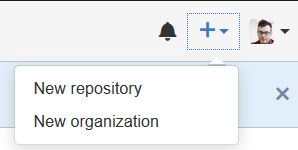
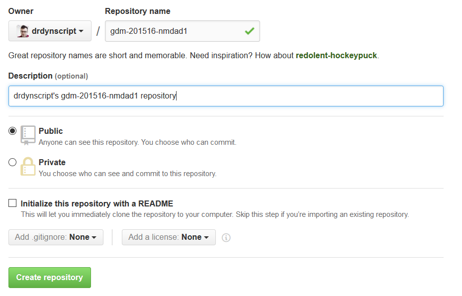
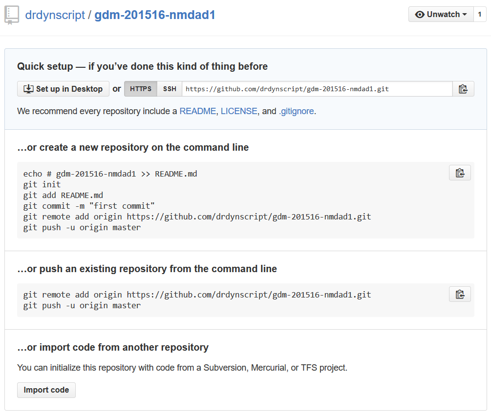
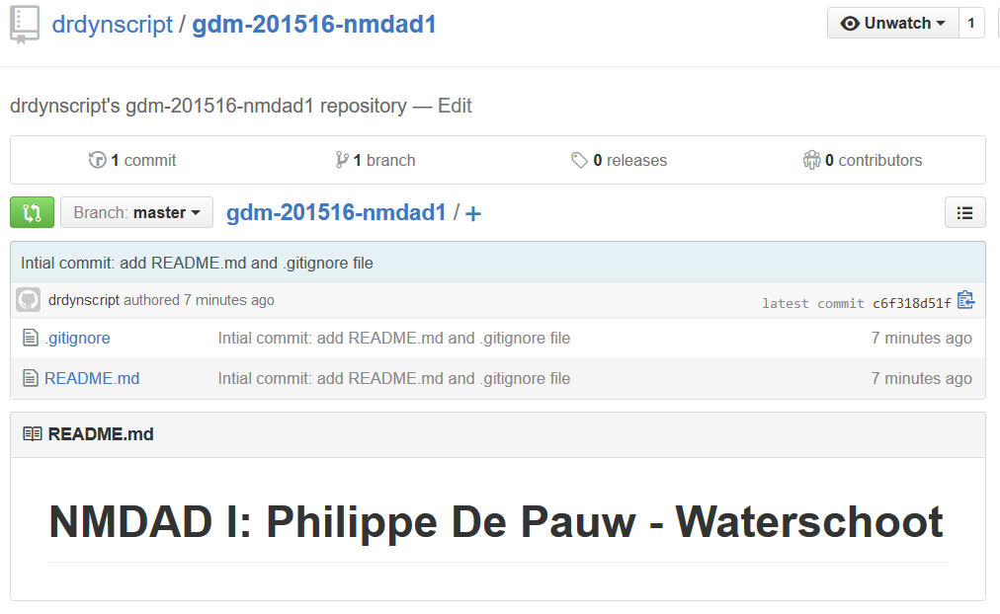

Git
==================

|Info|  |
|----|---|
|Olod|New Media Design & Development I|
|Auteur(s)|Philippe De Pauw - Waterschoot, Jonas Pottie|
|Opleiding|Bachelor in de Grafische en digitale media|
|Academiejaar|2015-16|

***

Inleiding
---------

Git is een revisie (revision control) beheersysteem en een broncode (source code) management systeem (SCM). Initieel ontwikkeld door Linus Torvalds voor de Linux Kernel Development. Iedere Git werkmap bevat een volledige **repository** met een overzicht van de geschiedenis en bevat ook **tracking capaciteiten**. Git is niet afhankelijk van een centrale opslagplaats!

Nieuwe versies van een app worden eerst **lokaal bewaard** in een **lokale copy van de centrale opslagplaats** (server). Deze lokale opslagplaats kan later **gesynchroniseerd** worden met de centrale opslagplaats. **Conflicten** in versies worden aangeduid door de git software, zodat een teamlid deze kan oplossen!

> **Git flow: **
>  
>  

**GitHub** is een webgebaseerde (web-based) service om software development projecten te herbergen (hosten) gebruik makend van het Git revisie (revision control) beheersysteem. Het wordt veel gebruikt voor open-source software development projecten. GitHub bevat de volgende plannen:

- Private repositories (betalend)
- Public repositories (gratis en open-source)
- GitHub Enterprise (GitHub systeem opzetten op eigen servers)

**Bitbucket** is een centraal systeem voor gedistribueerde versie control systeem. Het bevat o.a. **een issue tracker, wiki en integraties met andere populaire services, zoals Basecamp**. De gratis versie van Bitbucket bevat ook ondersteuning voor beschermde repositories, doch in aantal beperkt (max 5 op 7-10-2014). De community die GitHub gebruikt is ongeveer 5x zo groot dan deze die Bitbucket gebruiken (op 7-10-2014). GitHub private repositories zijn duurder dan deze uit Bitbucket, bron: <http://osintegrators.github.io/githubvbitbucket/>.
	
Installatie
-----------

###Windows

Download via: http://msysgit.github.io/

* Vergeet niet de laatste of voorlaatste optie te selecteren tijdens de Git Setup Installatie Wizard. Op deze manier kunnen we het git commando overal aanspreken (Het pad naar de Git executable wordt aan de systeemvariabelen toegevoegd)!


###OSX

Op OSX is het aan te raden om een aantal tools, zoals: Ruby, gem, Git, ... te installeren via Homebrew.

Links: <http://brew.sh/>, <https://github.com/Homebrew/homebrew/tree/master/share/doc/homebrew#readme>
   
Installatie:
`ruby -e "$(curl -fsSL https://raw.githubusercontent.com/Homebrew/install/master/install)"`

- Geïnstalleerde Homebrew packages:
	- `brew list`
- Lijst van geïnstalleerde Homebrew packages zonder afhankelijkheden (dependencies):
	- `brew leaves`
- Zoeken naar Homebrew packages online:
	- `brew search nodejs`
- Toon de informatie van een package:
	- `brew info nodejs`
- Update van Homebrew
	- `brew update`
	
**Installatie van Git via Homebrew**

- `brew install git`

**Installatie van Git via Homebrew achter een proxy-server**:

- `sudo -E brew install git`

###Linux OS, zoals UBUNTU

**Installatie van Git via apt-get**:

- `sudo apt-get install git`

**Installatie van Git via apt-get achter een proxy-server**:

- `sudo -E apt-get install git`

**Update van Git**:

- `sudo apt-get install git`
- of `sudo apt-get --only-upgrade install git`

Als alternatief kunnen we (Linuxbrew)(https://github.com/Homebrew/linuxbrew) gebruiker!

> De installatie van `git` kan getest worden door het commando `git` uit te voeren via commandline. 

Configuratie
------------

- Username
	- `git config --global user.name "drdynscript"`
- Email = Account
	- `git config --global user.email "drdynscript@gmail.com"`
- Proxy servers
	- `git config --global http.proxy "http://proxy.arteveldehs.be:8080"`
	- `git config --global https.proxy "http://proxy.arteveldehs.be:8080"`  
	- **Deze commando's worden enkel uitgevoerd indien we geen globale proxy instellingen hebben toegevoegd. Zie document [proxy instellingen](proxysettings.md)**.  
- Verwijderen van Proxy servers
	- `git config --global --unset http.proxy`
	- `git config --global --unset https.proxy`
- Https gebruiken i.p.v. git (proxy)
	- `git config --global url."https://github.com".insteadOf git://github.com`
- Editeren van `.gitconfig`
	- **OSX:** `vi ~/.gitconfig` of 'grep ~/.gitconfig' (vi & grep zijn editors)
	- **Windows via Microsoft Visual Code:** `code %HOMEPATH%/.gitconfig`

Door één van deze handelingen uit te voeren wordt er een configuratiebestand geschreven op de locatie `~/.gitconfig` (of `~/.config/git/config`). `~` komt overeen met de homelocatie van een gebruiker, bv. op Windows: `C:\Users\drdynscript`.

> **.gitconfig** bestand op Windows
>  
>  

Commando's
----------

- Toevoegen van bestanden en mappen aan de volgende commit.
	- `git add *.*`
- Commit of doorvoeren van de toegevoegde bestanden en mappen.
	- `git commit -m "Update Git Repository"`
- Push of versturen van de commit naar de online repository.
	- `git push -u origin master`

####Up-to-date blijven met de cursusinhoud

**Eénmalig klonen van de cursus** 

- `git clone https://github.com/gdm-201516-mmp2/nmdad1.git cursus-gdm-201516-nmdad1`

Om een update te ontvangen van de cursus, navigeren we naar de aangemaakte folder `cursus-gdm-201516-nmdad1`. Hierbinnen voeren we hetvolgende commando uit:

- `git pull origin master`

Het resultaat van dit commando geeft de wijzigingen en toevoegingen weer per bestand. Uiteraard kunnen jullie niet via de `push` optie van het `git` commando wijzigingen aanbrengen in deze cursus, maar suggesties en opmerkingen zijn steeds welkom.

.gitignore
----------

Via een `.gitignore` bestand in de root van een Git-enabled project vermelden we de folders en/of bestanden die we niet in de online repository willen overbrengen. Courante onderdelen binnen dit bestand zijn goed samengevat in deze [Gist .gitignore](https://gist.github.com/octocat/9257657).

Het `.gitignore` bestand bevat meestal regels voor IDE's, zoals JetBrains, Miscrosoft Visual Code, Dreamweaver, ... . Daarnaast moet gecompileerde code, zoals exe, com, rar, ... vermeld worden. Packages, logs, cache, tijdelijke folders, ... maken ook deel uit van het `.gitignore` bestand. Het onderstaande bestand geeft een goede indicatie van een courant `.gitignore` bestand. Via [gitignore.io](https://www.gitignore.io/) kunnen we zo'n bestand genereren.

```
# Created by https://www.gitignore.io

### PhpStorm ###
# Covers JetBrains IDEs: IntelliJ, RubyMine, PhpStorm, AppCode, PyCharm

/*.iml

## Directory-based project format:
.idea/
# if you remove the above rule, at least ignore the following:

# User-specific stuff:
# .idea/workspace.xml
# .idea/tasks.xml
# .idea/dictionaries

# Sensitive or high-churn files:
# .idea/dataSources.ids
# .idea/dataSources.xml
# .idea/sqlDataSources.xml
# .idea/dynamic.xml
# .idea/uiDesigner.xml

# Gradle:
# .idea/gradle.xml
# .idea/libraries

# Mongo Explorer plugin:
# .idea/mongoSettings.xml

## File-based project format:
*.ipr
*.iws

## Plugin-specific files:

# IntelliJ
out/

# mpeltonen/sbt-idea plugin
.idea_modules/

# JIRA plugin
atlassian-ide-plugin.xml

# Crashlytics plugin (for Android Studio and IntelliJ)
com_crashlytics_export_strings.xml
crashlytics.properties
crashlytics-build.properties

# Dreamweaver
_notes
dwsync.xml

# Microsoft Visual Code
.settings

# Compiled source
*.com
*.class
*.dll
*.exe
*.o
*.so 

# Packages
*.7z
*.dmg
*.gz
*.iso
*.jar
*.rar
*.tar
*.zip

# Logs and databases
*.log
*.sql
*.sqlite 

# OS generated files
.DS_Store
.DS_Store?
._*
.Spotlight-V100
.Trashes
ehthumbs.db
Thumbs.db

# Sass
.sass-cache
*.css.map

# Frontend Automation project
.tmp
tests
```

Naast dit lokaal bestand kunnen we ook een globaal `.gitignore` bestand aanmaken. Onder de **Home** folder (`~/.gitignore_global`) van de gebruiker maken we het bestand `.gitignore_global` aan waarin we de bovenvermelde inhoud toevoegen. Op deze manier hoeven we enkel in het lokaal bestand applicatiespecifieke instellingen toe te voegen.
  
Opdat deze globale instellingen van kracht worden moeten we dit `.gitignore_global` bestand toevoegen aan de Git configuratie:

`git config --global core.excludesfile ~/.gitignore_global`.

README.md
---------

Op GitHub en BitBucket staat dit README.md bestand in de hoofdfolder (top-level directory). Dit bestand, met de markdown syntax, wordt automatisch geconverteerd naar HTML. Het wordt gepresenteerd wanneer we de Git repository bezoeken. Het `README.md` bestand bevat meestal informatie over andere bestanden, folders of archieven binnen dezelfde repository. De naam wordt meestal beschreven in capitalen (uppercase), behalve de extensie.

Het `README.md` bestand bevat meestal één of meerdere onderwerpen als inhoud:

* Omschrijving van de repository (project)
* Oplijsting van aanwezige bestanden en folders
* Configuratie en installatie instructies
* Documentatie
* Gekende bugs
* Aanvragen voor toekomstige nieuwe features
* Auteurs
* Copyright en licentie


Tutorial Resumé on GitHub via Git
---------------------------------

1. Maak een nieuwe Repository aan in jouw GitHub account met de naam `gdm-201516-nmdad1`.  


2. Vul de naam en de omschrijving in van deze nieuwe repo (repository). Druk vervolgens op de `Create Repository` knop.  


3. Dit resulteert in het volgende scherm:  


4. Maak een folder aan op jouw lokale harde schijf via verkenner (finder) of via commandline (WIN: Command Prompt, MAC: Terminal).  
  
	```	
	C:\Users\drdyn>d:	
	D:\>cd Hogeschool	
	D:\Hogeschool>cd 2015-16	
	D:\Hogeschool\2015-16>mkdir gdm-201516-nmdad1	
	D:\Hogeschool\2015-16>cd gdm-201516-nmdad1	
	D:\Hogeschool\2015-16\gdm-201516-nmdad1>
	```
	
	* `cd` betekent **change directory**. In dit voorbeeld vertoeven we op de d-schijf en navigeren we naar de folder `Hogeschool`.
	* In de `Hogeschool` folder navigeren we naar de folder `2015-16` via `cd` commando.
	* Vervolgens maken we hierin een folder `gdm-201516-nmdad1` aan via het commando `mkdir`. `mkdir` betekent **Make Directory**.
	* Om in deze nieuwe aangemaakte folder te geraken voeren we het commando `cd gdm-201516-nmdad1` uit, waarbij `gdm-201516-nmdad1` de naam van de folder is.
	* __Om Git te activeren in deze folder moet de command prompt in deze folder zitten!__
	* Dit is een voorbeeld van creatie van folders via command line. Op jouw harde schijf kan je bijvoorbeeld geen `d:` partitie hebben. Waar je deze folder `gdm-201516-nmdad1` aanmaakt maakt niet uit, maar vergeet niet te navigeren in deze folder via de voorgaande stappen.
	
5. Om van deze folder een Git repository te maken of te herinitialiseren, voeren we het commando `git init` uit.  

	```
	D:\Hogeschool\2015-16\gdm-201516-nmdad1>git init
	Initialized empty Git repository in D:/Hogeschool/2015-16/gdm-201516-nmdad1/.git/
	
	D:\Hogeschool\2015-16\gdm-201516-nmdad1>
	```
	
	* Na dit commando gedraagt deze folder zich als een Git repository.
	
6. We moeten nu de online aangemaakte GitHub repository met de naam `gdm-201516-nmdad1` verbinden met deze lokale folder. Dit is gelijkaardig met de applicaties **Google Drive**, **One Drive** en **Dropbox**. Om deze verbinding tot stand te brengen voeren we hetvolgende commando uit:

	```
	D:\Hogeschool\2015-16\gdm-201516-nmdad1>git remote add origin https://github.com/drdynscript/gdm-201516-nmdad1.git
	```
	
	* De url die we aan dit commando toekennen staat vermeld in stap 3. Dit bevat meestal jouw GitHub loginnaam aangevuld met de naam van de aangemaakte repo + git extensie.
	* Na deze actie is de lokale folder verbonden met de online repository. Synchronisatie echter gebeurt niet automatisch en moet gerealiseerd worden via een aantal Git commando's. De meest gebruikte commando's hierbij zijn `git add`, `git commit` en `git push`. Wens je een update uit te voeren van de lokale folder naar de online repository, dan moet je deze drie commando's steeds uitvoeren.
	
7. We maken een bestand `.gitignore` aan in de lokale folder. De code vermeld in het hoofdstuk **.gitignore** kopiëren we als inhoud van dit bestand. Dit bestand kunnen we aanmaken via de verkenner of commandline: `echo # gdm-201516-nmdad1 >> .gitignore`. Na dit command staat er `# gdm-201516-nmdad1` als tekst in dit `.gitignore` bestand.

8. De voorgaande handeling herhalen we voor een nieuw bestand met de naam `README.md`. 

	```
	D:\Hogeschool\2015-16\gdm-201516-nmdad1>echo Philippe De Pauw - Waterschoot >> README.md
	```
	
	* Voeg de meest gekende onderdelen toe als inhoud voor dit `README.md` bestand. Vergeet ook niet later de toekomstige bestanden en folders hierin op te lijsten.
	
9. Op dit moment hebben we 2 bestanden aangemaakt in de lokale Git repository, namelijk: `.gitignore` en `README.md`. Deze staan echter nog niet in de online gekoppelde Git repository.

	* Via `git add` kunnen we gewijzigde inhoud toevoegen aan de volgende commit. We kunnen bestand per bestand toevoegen `git add README.md`, folders of alle gewijzigde inhoud binnen deze lokale repository `git add *.*`.
	* Om na te gaan welke bestanden gewijzig zijn kunnen we het commando `git status` uitvoeren.
	
		```
		D:\Hogeschool\2015-16\gdm-201516-nmdad1>git status
		On branch master
		
		Initial commit
		
		Untracked files:
		(use "git add <file>..." to include in what will be committed)
		
				.gitignore
				README.md
		
		nothing added to commit but untracked files present (use "git add" to track)
		```
		
	* We voeren dus nu het commando `git add *.*` uit.
	* Vervolgens voegen we de toegevoegde bestanden aan een nieuwe **commit** en beschrijven we in een string wat er gewijzigd is. De tekst begeleid dus deze **commit** en wordt ook weergegeven in GitHub naast de bestanden en/of folders die in deze commit aanwezig zijn.
	
		```
		D:\Hogeschool\2015-16\gdm-201516-nmdad1>git commit -m "Intial commit: add README.md and .gitignore file"
		[master (root-commit) c6f318d] Intial commit: add README.md and .gitignore file
		2 files changed, 99 insertions(+)
		create mode 100644 .gitignore
		create mode 100644 README.md
		```
		
	* Via `git push` commando kunnen we deze commit nu versturen naar de gekoppelde online Git repository.
	
		```
		D:\Hogeschool\2015-16\gdm-201516-nmdad1>git commit -m "Intial commit: add README.md and .gitignore file"
		[master (root-commit) c6f318d] Intial commit: add README.md and .gitignore file
		2 files changed, 99 insertions(+)
		create mode 100644 .gitignore
		create mode 100644 README.md
		
		D:\Hogeschool\2015-16\gdm-201516-nmdad1>git push -u origin master
		Username for 'https://github.com': drdynscript
		Password for 'https://drdynscript@github.com':
		Counting objects: 4, done.
		Delta compression using up to 4 threads.
		Compressing objects: 100% (4/4), done.
		Writing objects: 100% (4/4), 1009 bytes | 0 bytes/s, done.
		Total 4 (delta 0), reused 0 (delta 0)
		To https://github.com/drdynscript/gdm-201516-nmdad1.git
		* [new branch]      master -> master
		Branch master set up to track remote branch master from origin.
		```
10. Refreshen we nu de online Git repo in the browser, zie stap 3., dan merken we op dat: de 2 bestanden: `README.md` en `.gitignore` toegevoegd zijn en dat de inhoud uit het `README.md` bestand getoond wordt. **We kunnen bij iedere lokale wijziging stap 9 en 10 herhalen.**


Bronnen
-------------

> **Git:**
>  
- <https://training.github.com/kit/downloads/github-git-cheat-sheet.pdf>
- <http://courses.olivierparent.be/servermanagement/local-development-environment/installing-design-and-development-tools/source-control/>
- <http://git-scm.com/docs/gitignore>
- <http://git-scm.com/book/en/v2/Git-Basics-Recording-Changes-to-the-Repository>
- <https://github.com/github/gitignore>
- <http://git-scm.com/docs/git-init>
- <http://git-scm.com/docs/git-remote>
- <https://help.github.com/articles/create-a-repo/>
- <http://git-scm.com/docs/git-add>
- <http://git-scm.com/docs/git-commit>
- <http://git-scm.com/docs/git-push>