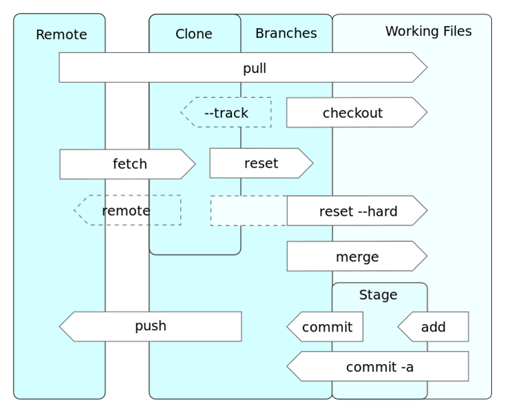
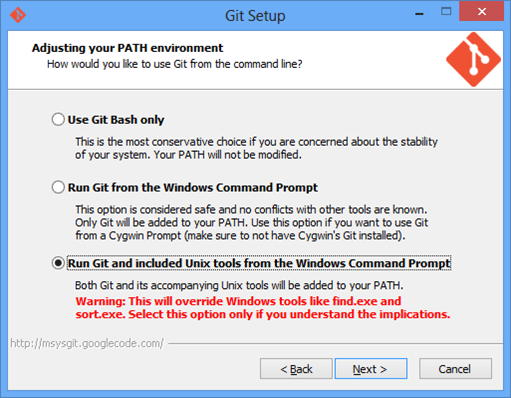
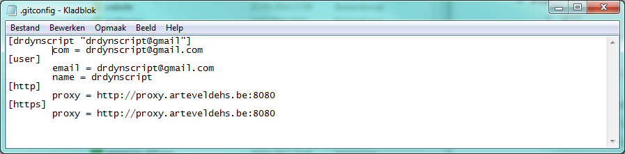

Git
==================

|Info|  |
|----|---|
|Olod|New Media Design & Development I|
|Auteur(s)|Philippe De Pauw - Waterschoot, Jonas Pottie|
|Opleiding|Bachelor in de Grafische en digitale media|
|Academiejaar|2015-16|

***

Inleiding
---------

Git is een revisie (revision control) beheersysteem en een broncode (source code) management systeem (SCM). Initieel ontwikkeld door Linus Torvalds voor de Linux Kernel Development. Iedere Git werkmap bevat een volledige **repository** met een overzicht van de geschiedenis en bevat ook **tracking capaciteiten**. Git is niet afhankelijk van een centrale opslagplaats!

Nieuwe versies van een app worden eerst **lokaal bewaard** in een **lokale copy van de centrale opslagplaats** (server). Deze lokale opslagplaats kan later **gesynchroniseerd** worden met de centrale opslagplaats. **Conflicten** in versies worden aangeduid door de git software, zodat een teamlid deze kan oplossen!

> **Git flow: **
>  
>  

**GitHub** is een webgebaseerde (web-based) service om software development projecten te herbergen (hosten) gebruik makend van het Git revisie (revision control) beheersysteem. Het wordt veel gebruikt voor open-source software development projecten. GitHub bevat de volgende plannen:

- Private repositories (betalend)
- Public repositories (gratis en open-source)
- GitHub Enterprise (GitHub systeem opzetten op eigen servers)

**Bitbucket** is een centraal systeem voor gedistribueerde versie control systeem. Het bevat o.a. **een issue tracker, wiki en integraties met andere populaire services, zoals Basecamp**. De gratis versie van Bitbucket bevat ook ondersteuning voor beschermde repositories, doch in aantal beperkt (max 5 op 7-10-2014). De community die GitHub gebruikt is ongeveer 5x zo groot dan deze die Bitbucket gebruiken (op 7-10-2014). GitHub private repositories zijn duurder dan deze uit Bitbucket, bron: <http://osintegrators.github.io/githubvbitbucket/>.
	
Installatie
-----------

###Windows

Download via: http://msysgit.github.io/

* Vergeet niet de laatste of voorlaatste optie te selecteren tijdens de Git Setup Installatie Wizard. Op deze manier kunnen we het git commando overal aanspreken (Het pad naar de Git executable wordt aan de systeemvariabelen toegevoegd)!

###OSX

Op OSX is het aan te raden om een aantal tools, zoals: Ruby, gem, Git, ... te installeren via Homebrew.

Links: <http://brew.sh/>, <https://github.com/Homebrew/homebrew/tree/master/share/doc/homebrew#readme>
   
Installatie:
`ruby -e "$(curl -fsSL https://raw.githubusercontent.com/Homebrew/install/master/install)"`

- Geïnstalleerde Homebrew packages:
	- `brew list`
- Lijst van geïnstalleerde Homebrew packages zonder afhankelijkheden (dependencies):
	- `brew leaves`
- Zoeken naar Homebrew packages online:
	- `brew search nodejs`
- Toon de informatie van een package:
	- `brew info nodejs`
- Update van Homebrew
	- `brew update`
	
**Installatie van Git via Homebrew**

- `brew install git`

**Installatie van Git via Homebrew achter een proxy-server**:

- `sudo -E brew install git`

###Linux OS, zoals UBUNTU

**Installatie van Git via apt-get**:

- `sudo apt-get install git`

**Installatie van Git via apt-get achter een proxy-server**:

- `sudo -E apt-get install git`

**Update van Git**:

- `sudo apt-get install git`
- of `sudo apt-get --only-upgrade install git`

Als alternatief kunnen we (Linuxbrew)<https://github.com/Homebrew/linuxbrew> gebruiker!

> De installatie van `git` kan getest worden door het commando `git` uit te voeren via commandline. 

Configuratie
------------

- Username
	- `git config --global user.name "drdynscript"`
- Email = Account
	- `git config --global user.email "drdynscript@gmail.com"`
- Proxy servers
	- `git config --global http.proxy "http://proxy.arteveldehs.be:8080"`
	- `git config --global https.proxy "http://proxy.arteveldehs.be:8080"`    
- Verwijderen van Proxy servers
	- `git config --global --unset http.proxy`
	- `git config --global --unset https.proxy`
- Https gebruiken i.p.v. git (proxy)
	- `git config --global url."https://github.com".insteadOf git://github.com`
- Editeren van `.gitconfig`
	- **OSX:** `vi ~/.gitconfig` of 'grep ~/.gitconfig' (vi & grep zijn editors)

Door één van deze handelingen uit te voeren wordt er een configuratiebestand geschreven op de locatie `~/.gitconfig` (of `~/.config/git/config`). `~` komt overeen met de homelocatie van een gebruiker, bv. op Windows: `C:\Users\drdynscript`.

> **.gitconfig** bestand op Windows
>  
>  

Commando's
----------

- Toevoegen van bestanden en mappen aan de volgende commit.
	- `git add *.*`
- Commit of doorvoeren van de toegevoegde bestanden en mappen.
	- `git commit -m "Update Git Repository"`
- Push of versturen van de commit naar de online repository.
	- `git push -u origin master`

####Up-to-date blijven met de cursusinhoud

**Eénmalig klonen van de cursus** 

- `git clone https://github.com/gdm-201516-mmp2/nmdad1.git gdm-201516-nmdad1`

Om een update te ontvangen van de cursus, navigeren we naar de aangemaakte folder `gdm-201516-nmdad1`. Hierbinnen voeren we hetvolgende commando uit:

- `git pull origin master`

Het resultaat van dit commando geeft de wijzigingen en toevoegingen weer per bestand. Uiteraard kunnen jullie niet via de `push` optie van het `git` commando wijzigingen aanbrengen in deze cursus, maar suggesties en opmerkingen zijn steeds welkom.

Bibliografie
-------------

> **Git:**
>  
- <https://training.github.com/kit/downloads/github-git-cheat-sheet.pdf>
- <http://courses.olivierparent.be/servermanagement/local-development-environment/installing-design-and-development-tools/source-control/>