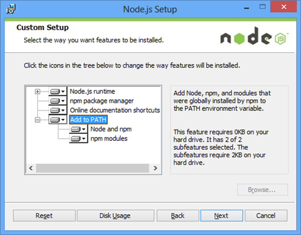

Node Package Manager
==================

|Info|  |
|----|---|
|Olod|New Media Design & Development I|
|Auteur(s)|Philippe De Pauw - Waterschoot, Jonas Pottie|
|Opleiding|Bachelor in de Grafische en digitale media|
|Academiejaar|2015-16|

***

Inleiding
---------
npm](https://npmjs.org/ "Node Package Manager") staat voor Node Packaged Modules (officieel) of Node Package Manager (community). Het is de officiële “package manager” voor Node.js. NPM bevat een aantal hoofdfunctionaliteiten:

- Runt via de command line
- Beheer (Management) van afhankelijkheden (dependencies) binnen een applicatie
- Installatie van Node.js applicaties die beschikbaar zijn op de `npmRegistry`
- Gekende `npm` packages: `bower`, `grunt`, `gulp`, `yo`, `underscore`, `lodash`, `express`, ...
- Zoeken naar packages via webapplicatie: <https://www.npmjs.org/>

Installatie
-----------

###Windows

Installatie van npm gebeurt via de download van [Node.js](http://nodejs.org/download/ "Node.js"). 

  
- Aan te raden om alle opties te selecteren!
- **Add to Path** is noodzakelijk om om het even welke locatie op de harde schijf Node.js en npm aan te spreken via de command line.

>

###OSX

**Installatie npm via Homebrew**:

- `brew install nodejs`

**Indien npm niet aanwezig zou zijn in de `nodejs` distributies**:

- `brew install npm`

> De installatie van Node Package Manager kan getest worden door het commando `npm` uit te voeren via commandline. 

Configuratie
------------

Door het commando `npm config edit` uit te voeren wordt er een configuratiebestand geschreven op de locatie `~/.npmrc`. `~` komt overeen met de homelocatie van een gebruiker, bv. op windows: `C:\Users\drdynscript`. In dit bestand worden alle nuttige instellen, met betrekking op Node Package Manager, toegevoegd. De meeste instellingen staan weliswaar in commentaar en zijn dus nog niet actief!

Om een instelling actief te maken verwijderen we `;` vooraan uit een regel. Dit kunnen we bijvoorbeeld doen bij de instellingen `proxy` en `https_proxy` wanneer we surfen op internet via een proxy server, bijvoorbeeld: `http://proxy.arteveldehs.be:8080`.

Instellingen van `npm` kunnen ook uitgevoerd worden via commandline:

- `npm set http_proxy http://proxy.arteveldehs.be:8080`
- `npm set https_proxy http://proxy.arteveldehs.be:8080`

- Editeren van `.npmrc`
	- **OSX:** `vi ~/.npmrc` of 'grep ~/.npmrc' (vi & grep zijn editors)
	- **Windows via Microsoft Visual Code:** `code %HOMEPATH%/.npmrc`

> **.npmrc** bestand
>  
>  

Commando's
----------
  
- Update `npm` naar de laatste beschikbare versie of globale installatie.
	- `npm update -g npm`
- Ophalen van het versienummer van `npm`.
	- `npm --version` 
- Lokale installatie van `bower`.
	- `npm install bower`  
- Bekijken van de details van een npm package, in dit geval `gulp`.
	- `npm view gulp`
- Zoeken naar bepaalde packages via zoekstrings.
	- `npm search grunt`  
	

Bibliografie
-------------

> **npm:**
>  
- <http://browsenpm.org/help>
- <https://www.npmjs.org/>
- <https://www.npmjs.org/browse/star>