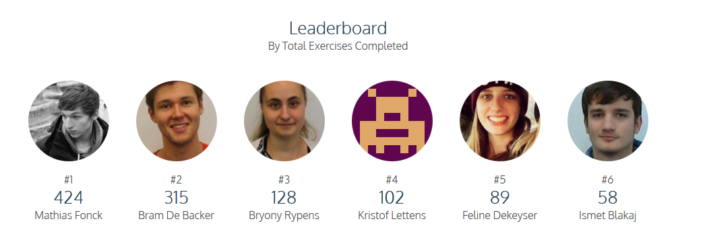
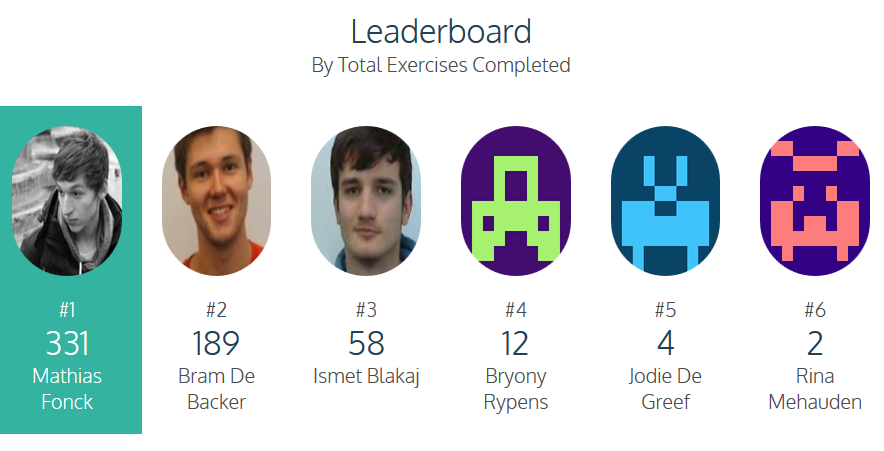

Taken Blended Learning
======================

|Info|  |
|----|---|
|Olod|New Media Design & Development I|
|Auteur(s)|Philippe De Pauw - Waterschoot, Jonas Pottie|
|Opleiding|Bachelor in de Grafische en digitale media|
|Academiejaar|2015-16|

***

* Registreer je op [Codecademy](https://www.codecademy.com).
	* Gebruik als naam jouw loginnaam van de Arteveldehogeschool.
	* Gebruik jouw email-adres van de arteveldehogeschool.
	* Pas jouw **Profile Picture** aan via [account](https://www.codecademy.com/account).
	* Studenten worden door de docenten toegevoegd als **pupils**.
* Doorloop de volgende eenheden (units) in Codecademy
	* HTML & CSS (https://www.codecademy.com/en/tracks/web)
	* Make a Website (https://www.codecademy.com/en/skills/make-a-website)
	* JavaScript (https://www.codecademy.com/en/tracks/javascript)
	* jQuery (https://www.codecademy.com/en/tracks/jquery)
	* Make an Interactive Website (https://www.codecademy.com/en/skills/make-an-interactive-website)
	* Make a Website Projects(https://www.codecademy.com/en/courses/html-css-prj)
	* __Nieuw 24-09-2015: Learn the commandline__ (https://www.codecademy.com/en/courses/learn-the-command-line)
	
> Deze **Blended Learning** cursussen moeten allemaal voltooid zijn op 04-11-2015! Niet voltooid betekent -2 per week op 20 op de eindscore van het opleidingsonderdeel NMDAD I! 

> Voor wat hoort wat op het einde van de rit:
* 1ste plaats: + 2/20 op de eindscore
* 2de plaats: + 1.5/20 op de eindscore
* 3de plaats: + 1/20 op de eindscore

***

Leaderbords
------------------------------

###Leaderbords 24-09-2015 om 20u

###Leaderbord 21-09-2015 om 21:30 
